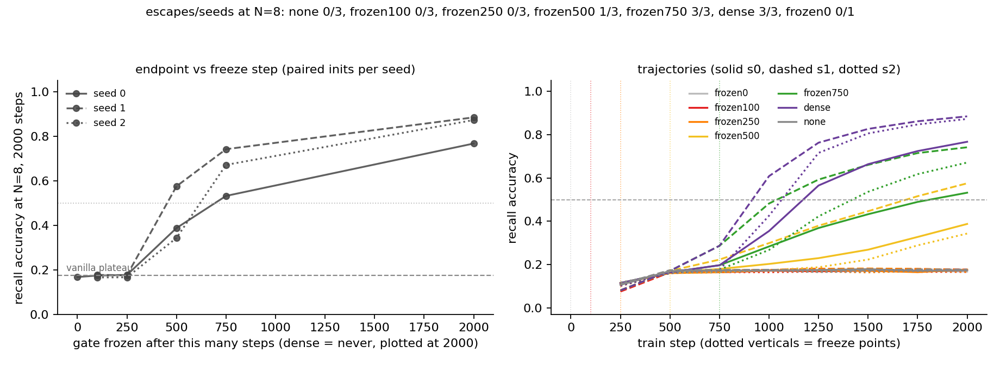

# MQAR gate freeze before breakout: no early sufficiency — gate learning is rate-limiting right up to the breakout it causes

**Date:** 2026-08-01 · **Status:** done

## Hypothesis
On the `mqar-gate-noise-control` harness (d=64, N=8, 2000 steps), the dense gate's causal work is concentrated at (or just before) the breakout window (~750–1250 steps): freezing the gate at step 750 should still allow escape, while freezing at 100–250 (when the gate has barely moved from its near-static init, a known no-op regime) should strand the model on the vanilla plateau — with the transition point revealing whether a partially-trained gate suffices to open the door or gate learning must span the whole pre-escape window.

## Method
- Harness byte-identical to `2026-07-26_mqar-state-capacity` / `2026-07-28_mqar-min-selectivity` / `2026-07-29_mqar-gate-noise-control`: zoology-style MQAR (64 keys / 64 values, all N keys queried in permuted order), 2-block pre-norm transformer, d=64, 2 heads, elu+1 linear attention with dense per-channel decay gate on the exact closed-form code path, AdamW 1e-3 / wd 0.01, batch 64, 2000 steps, N=8, eval grid 250.
- **Design upgrade over 2026-07-29:** every dense-family arm (`dense` + every `frozenK`) uses the SAME init key in the seed formula, so within a seed all freeze arms start byte-identical and see the identical data stream. Trajectories are identical up to the freeze step; any later divergence is caused by the freeze alone. This is a paired comparison with zero init confound — the fix for the 2026-07-28 lesson that escape events near the plateau are init-sensitive. (2026-07-29's `frozen1000` arm could not do this: its arm name entered the init seed.)
- Arms: gate params `requires_grad=False` after {0, 100, 250, 500, 750} updates, vs `dense` (never frozen) and `none` (vanilla, g=1). Seeds {0,1,2} everywhere except `frozen0` (seed 0 only; W=0/bias=3 static decay is a known no-op from 2026-07-28). Also logged: the gate's distance from init (‖W‖ᶠ, ‖b−b₀‖) at freeze time and at end — "how much gate learning had happened when we froze" is measured, not guessed.
- 19 runs, 22.3 min CPU total.

## How to run
```bash
pip install -r requirements.txt
python run.py
```

## Result
**A graded ramp with a hard floor — and no early sufficiency:**

| freeze step | gate ‖W‖ at freeze (% of dense final ≈25.3) | N=8 acc (s0/s1/s2) | escape steps | escapes |
|---|---|---|---|---|
| 0 (never trains) | 0 (0%) | 0.168 | — | 0/1 |
| 100 | ≈3.3 (13%) | 0.174 / 0.177 / 0.166 | — | 0/3 |
| 250 | ≈9.3 (37%) | 0.177 / 0.176 / 0.167 | — | 0/3 |
| 500 | ≈14.2 (56%) | 0.388 / 0.575 / 0.343 | — / 1750 / — | 1/3 |
| 750 | ≈17.8 (70%) | 0.532 / 0.742 / 0.671 | 2000 / 1250 / 1500 | 3/3 |
| never (dense) | 25.3 (100%) | 0.767 / 0.885 / 0.873 | 1250 / 1000 / 1250 | 3/3 |

- **The floor:** freezing at 250 steps is an *exact* no-op — indistinguishable from vanilla (0.174 mean vs 0.174) even though the gate has already covered ~37% of its final weight-norm travel. A one-third-trained gate opens nothing.
- **The ramp:** frozen500 lifts off the plateau on all 3 seeds (0.34–0.58) but escapes only 1/3 times within budget; frozen750 escapes 3/3 but *delayed* (+250 to +750 steps vs its paired dense run) and ends 0.13–0.24 lower. Endpoint accuracy is monotone in freeze step within every seed — with paired inits and identical data, that ordering is causal, not init noise.
- **No early sufficiency:** every freeze strictly before the seed's breakout hurts. Combined with 2026-07-29's frozen1000 (post-breakout freeze = free, if anything slightly better than dense), the gate's critical window ends *exactly at breakout*: gate learning matters right up to the escape it causes, and not one eval-tick after.
- **Censoring caveat (honest):** frozen500's seeds 0/2 are still climbing at step 2000 — the freeze looks more like a slope-reducer than a ceiling. "Fails to escape" is budget-relative, the same lesson as 2026-07-28; escape-time, not endpoint, is the honest axis (and by that axis the delay is monotone in withheld gate learning).
- Replications: vanilla (0.174/0.177) and dense seeds 0/1 (0.767 esc 1250 / 0.885 esc 1000) reproduce 2026-07-29 to the fourth decimal (byte-identical inits and data); dense seed 2 (0.873, esc 1250) is a new confirmation of reliable dense escape.



## Takeaway
The 2026-07-29 phrasing "the gate opens the door and can then stop learning" was half right: the gate can stop learning *after* breakout at zero cost, but there is no cheap early door-opening. Freezing the gate anywhere before breakout — even at 70% of its final weight-norm travel — delays escape and lowers the endpoint, monotonically in how early you freeze, on byte-identical paired inits. So the gate is not a one-shot trigger whose work is banked early; it is *rate-limiting through the entire pre-escape window*, and the breakout happens at the moment the (still-improving) gate gets good enough. The graded frozen500/750 arms sharpen the registry's running account: a half-trained gate produces a slower, later, weaker version of the same breakout, which is exactly the "selectivity = plateau-escape accelerant" picture from 2026-07-28, now with the accelerant's dose-response curve measured. Next (appended to backlog): if gate learning is the rate limiter, boosting ONLY the gate's learning rate (×4 / ×16, paired inits) should pull the breakout earlier — the causal test in the opposite direction.

## Novelty check
- Verdict: novel (freeze-timing dose-response design within our own thread; conceptually adjacent to the critical-learning-periods literature, which deficits *data/architecture*, not a single named 8320-param subsystem, and never on a recall task with paired inits)
- Note: `scripts/novelty_check.py` blocked again in tonight's sandbox (HTTP 403 from both arXiv and OpenAlex); searched via web search instead, plus registry grep (`freeze`, `gate`, `mqar` — parents: 2026-07-28_mqar-min-selectivity, 2026-07-29_mqar-gate-noise-control).
- Closest prior work: [Critical Learning Periods in Deep Networks (Achille et al., ICLR 2019)](https://openreview.net/pdf?id=BkeStsCcKQ) (early-training windows where deficits cause permanent damage — but the deficit is data corruption, not freezing a named subsystem, and recovery is measured after removing the deficit), [One Period to Rule Them All (2506.15954)](https://arxiv.org/html/2506.15954) (identifies critical periods across architectures, same data-deficit paradigm), [Gated Slot Attention (2409.07146)](https://proceedings.neurips.cc/paper_files/paper/2024/file/d3f39e51f5f634fb16cc3e658f8512b9-Paper-Conference.pdf) and [GLA (2312.06635)](https://arxiv.org/abs/2312.06635) (gate ablations vary parametrization, never freeze-timing), [Gating is Weighting (2504.04308)](https://arxiv.org/abs/2504.04308) (theory predicting content-dependent gates matter, silent on when they must learn).
- How this differs: freeze-timing curves exist for whole networks and layers (probing/linear-transfer literature), but we found no experiment that (a) freezes only the forget-gate pathway of a linear-attention model at a sweep of pre-breakout times, (b) on a recall task with a known plateau→breakout transition, (c) with byte-identical paired inits so the freeze-step→outcome monotonicity is causal, and (d) pairs it with a measured gate-travel fraction at each freeze. The result — no early sufficiency, critical window ending exactly at breakout — is a precise timing claim the gate-ablation literature does not contain.
