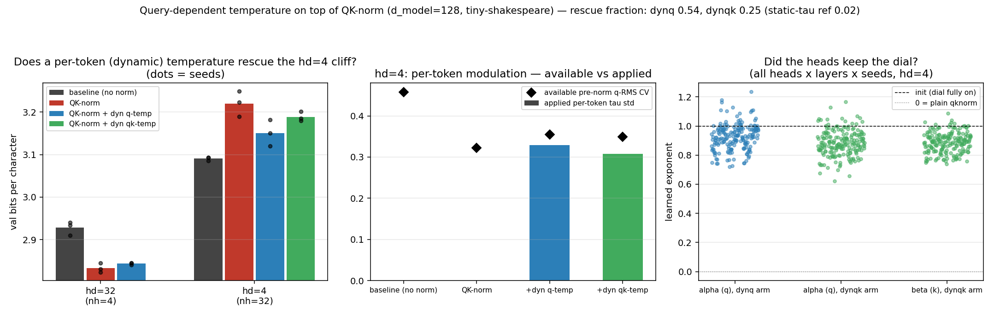

# Query-dependent (per-token) temperature on top of QK-norm: the dynamic-temperature test of the hd=4 cliff

**Date:** 2026-08-02 · **Status:** done (positive partial rescue: 54%)

## Hypothesis
2026-07-30_qknorm-head-dim found that QK-norm costs +0.143 bpc at head_dim=4 while helping every
other split, and 2026-07-31_qknorm-hd4-temperature-rescue causally eliminated the first proposed
mechanism: a free per-head STATIC learnable temperature refunds only 2% of the cliff and the
optimizer leaves it at tau≈1. That experiment's closing suspect: what RMS-norm destroys and a
static scalar cannot restore is **per-token (query-dependent) logit magnitude** — an unnormalised
head can modulate its own sharpness token-by-token via ‖q_t‖. If that is the load-bearing
quantity, restoring it as an explicit dynamic temperature on top of QK-norm should close the
cliff where the static dial could not.

## Method
- Architecture: 2-layer pre-norm char GPT, d_model=128, d_ff=512 — byte-compatible with the
  2026-07-30/31 harness. Configs (n_head, head_dim) ∈ {(4,32), (32,4)}: the qknorm optimum
  (do-no-harm control) and the cliff.
- Dynamic temperature: on top of QK-norm, each head scales its normalised query at token t by
  **tau_{t,h} = (r_{t,h} / EMA_h)^alpha_h**, where r is the DETACHED pre-norm q-RMS of that
  token in that head, EMA_h is a train-time running mean (momentum 0.99, frozen at eval,
  batchnorm-style), the ratio is clamped to [1/8, 8], and alpha_h is a per-head learnable
  exponent, init 1.0 — the dial starts fully ON and alpha→0 recovers plain qknorm, so the
  optimizer can keep, tune, or discard it. Arm `qknorm_dynqk` adds the identical machinery on
  the key side (beta_h, own EMA).
- Arms: baseline (no norm), qknorm, qknorm_dynq (both configs), qknorm_dynqk (cliff only).
- Training: identical recipe (AdamW 3e-3 cosine, wd 0.1 with gains/alphas excluded, 600 steps,
  batch 16, block 96, tiny-shakespeare, val bpc on 480 held-out blocks).
- Controls: identical shared-weight init across all arm×config cells per seed (gains/alphas
  init deterministically, consume no RNG; verified by init signature), shared batch stream per
  seed, 3 seeds. 21 runs, 874 s total on 2 CPU threads.

## How to run
```bash
pip install -r requirements.txt
python run.py        # SMOKE=1 python run.py for a 40-step smoke test
```

## Result
**The dynamic dial does what the static dial could not: query-side per-token temperature
refunds 54% of the cliff — and the win comes from modulation, not from average sharpness.**

| arm | hd=32 bpc | hd=4 bpc | rescue fraction at hd=4 |
|---|---|---|---|
| baseline | 2.928 | 3.090 | — |
| qknorm | 2.833 | 3.220 | (cliff = +0.130) |
| qknorm + dynamic q-temp | 2.844 | 3.151 | **0.54** |
| qknorm + dynamic qk-temp | — | 3.189 | 0.25 |
| *(2026-07-31: + static per-head tau)* | *2.829* | *3.218* | *0.02* |

- The cliff replicates a third time: +0.130 bpc (per-seed +0.104/+0.130/+0.156, 3/3 positive).
- **Query-side rescue is large and eerily stable: 0.073/0.067/0.070 bpc across the three
  paired seeds** (identical init + batch stream), even though the cliff itself varies 1.5x.
  Rescue fraction 0.54 vs the static dial's 0.02 — a 25x difference between two arms that
  differ only in whether tau can depend on the token.
- **The mechanism is NOT mean sharpness.** Average attention entropy barely moves (0.896 vs
  qknorm's 0.902; baseline 0.736), top-1 weight 0.106 vs 0.108, mean logit std 1.34 vs 1.27.
  What changes is the per-token SPREAD: applied tau std ≈ 0.33 per token, tracking the
  available pre-norm q-RMS variability (CV 0.35). Combined with 2026-07-31 this is a clean
  two-sided causal decomposition: static temperature (mean) buys ~0, dynamic temperature
  (variance) buys half the cliff.
- **The heads keep the dial engaged.** Learned alphas stay near init: mean 0.92, range
  0.72–1.23 across 64 heads × 2 layers × 3 seeds — never driven toward 0 (= discard). The
  asymmetry with 2026-07-31 is instructive: the optimizer would not *reach for* sharpness
  (static tau stayed at 1 when off), but it *holds on* to per-token modulation when handed it.
- **Key-side magnitude is not the missing piece — it is a liability.** Adding the identical
  machinery on keys drops the rescue to 0.25 (dynqk worse than dynq in 2/3 seeds, −0.038 bpc
  on the mean). Whatever ‖k_s‖ carried in the baseline, indiscriminately re-injecting it as
  key salience hurts a 4-dim head.
- Do-no-harm at hd=32: dynq costs +0.011 bpc vs plain qknorm — it keeps 89% of QK-norm's win
  there (2.844 vs baseline 2.928), so the dial is close to free where it is not needed.
- Remaining gap: dynq still sits +0.060 bpc above baseline at hd=4 — 46% of the cliff is
  explained by neither static nor query-dynamic temperature.



## Takeaway
The 2026-07-31 suspect is confirmed as a major mechanism: roughly **half of the hd=4 QK-norm
penalty is the loss of query-dependent per-token sharpness modulation**, restorable by a
one-parameter-per-head dynamic temperature fed the detached pre-norm q-RMS — while the same
quantity delivered as a static per-head scalar buys 25x less. Small heads do not want to be
*sharper*; they want to *vary* their sharpness token-by-token. Key-side magnitude, the obvious
sibling, actively hurts. The unexplained 46% narrows the remaining suspects to what our tau
deliberately excluded: the **gradient path through the magnitude** (r is detached here — the
baseline can LEARN where to place large ‖q_t‖, our arm can only consume its statistics) and
exact-form differences (clamp, EMA-relative rather than absolute). Next: the undetached version
— let gradients flow through r — added to the backlog as `qknorm-hd4-undetached-magnitude`; if
that closes the rest, the cliff story ends as "QK-norm severs a learnable per-token sharpness
channel that 4-dim heads depend on."

Caveats: 600-step early-training regime, one dataset, d_model=128 only, tau form is
EMA-relative with a [1/8, 8] clamp rather than raw ‖q_t‖.

## Novelty check
- Verdict: partial-prior-art
- Closest prior work: NaLaFormer / "Norm×Direction: Restoring the Missing Query Norm"
  ([2506.21137](https://arxiv.org/html/2506.21137v2)) restores query-norm-as-entropy-dial in
  **linear** attention for vision; σReparam ([2303.06296](https://arxiv.org/pdf/2303.06296))
  and entropy-collapse work study temperature/entropy control for stability at scale; learnable
  softmax temperatures are standard ([QK-norm paper 2010.04245](https://arxiv.org/abs/2010.04245),
  [Nick Ryan's writeup](https://nickcdryan.com/2024/08/02/introducing-a-learnable-temperature-value-into-the-self-attention-scores/),
  [QK-norm surveys](https://www.emergentmind.com/topics/query-key-normalization-qk-norm)).
- How this differs: prior work restores or controls temperature to *improve* models; nobody
  appears to use a per-token temperature as a **causal probe of the tiny-head-dim penalty
  under QK-norm**, and the static-vs-dynamic decomposition (2% vs 54% of the same cliff, with
  mean sharpness unchanged) plus the key-side negative result are new observations. (arXiv/
  OpenAlex endpoints were 403-blocked in tonight's sandbox as on previous nights; the check was
  done via web search from the session — sources above — plus a registry grep.)
