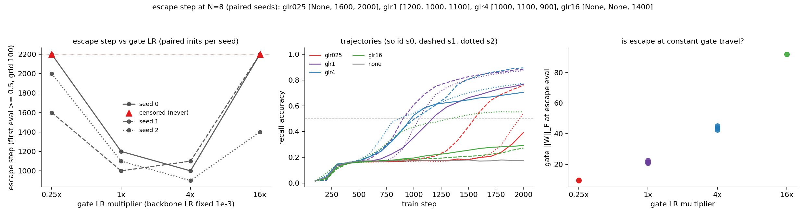

# MQAR gate LR ratio: does boosting only the gate's learning rate pull breakout earlier?

**Date:** 2026-08-03 · **Status:** done

## Hypothesis
If withheld gate learning delays breakout (2026-08-01: freeze-timing monotone on paired inits), then adding gate learning should advance it: multiplying only the gate's learning rate by {0.25, 1, 4, 16} should shift the escape step monotonically earlier, with gate weight-norm travel at escape roughly constant across multipliers (travel-as-clock), and a possible destabilization at 16x.

## Method
- Architecture: the 2026-07-28/29/08-01 harness unchanged — 2-block elu+1 linear-attention transformer (d=64, 2 heads, 86k params) with a dense per-channel forget gate (`Linear(d_model -> h*dh)`, W init 0, bias init 3), decay-masked exact closed form.
- Task / dataset: synthetic MQAR, N=8 key-value pairs, key/val vocab 64, fresh batches every step, byte-identical generators to the parents.
- What is varied vs held fixed: ONLY the gate parameters' AdamW learning rate, via a per-parameter-group multiplier m ∈ {0.25, 1, 4, 16} on the base LR 1e-3 (backbone LR fixed). Because the multiplier is optimizer-side, all gated arms share one init key: within a seed every glr* run is byte-identical at step 0 and sees identical batches — the 2026-08-01 pairing design applied to LR. `glr1` is an exact replication of 2026-08-01's `dense` arm; `none` (vanilla, no gate) anchors the plateau. 3 paired seeds x 4 multipliers + anchor = 13 runs, 2000 steps each, eval grid refined 250 -> 100 because escape step is the primary metric. Gate travel (||W||_F from 0, ||b−b0||) logged at every eval.

## How to run
```bash
pip install -r requirements.txt
python run.py
```

## Result
**The dose-response is a U, not the predicted monotone: gate learning speed is a floor, not a throttle.** Escape steps (first eval ≥ 0.5) across paired seeds:

| gate LR | escape steps (s0/s1/s2) | mean final acc | gate ‖W‖ at escape |
|---|---|---|---|
| 0.25x | censored / 1600 / 2000 | 0.564 | 9.5 |
| 1x | 1200 / 1000 / 1100 | 0.842 | 21.6 |
| 4x | 1000 / 1100 / 900 | 0.791 | 43.9 |
| 16x | censored / censored / 1400 | 0.372 | 92.0 |
| vanilla | never | 0.174 | — |

Starving the gate (0.25x) delays breakout by 500+ steps or off the budget (2/3 escape, late) — the reverse-direction confirmation of 2026-08-01's freeze result. But boosting it 4x buys only ~133 steps (≈ one eval-grid tick, inside seed spread), and 16x is actively destructive: 2/3 seeds never escape, creeping to ~0.28 (a new failure mode above the vanilla plateau 0.174 but far below breakout, still rising at 2000 steps; no NaN — this is not an instability blow-up, it is a wrong-lesson gate). Travel-as-clock is refuted twice over: gate ‖W‖ at escape spans 10x (9.5 -> 92), almost exactly proportional to the LR multiplier — i.e. for m ≥ 1 escape happens at roughly constant *step* (~1000) while the gate racks up whatever travel its LR allows. And cross-referencing 2026-08-01: glr025 escapes with total travel ~9.5-10.2, the same travel frozen250 had banked when freezing made it a permanent no-op — so what matters is that the gate is *still learning* around breakout time, not how far it has traveled.

`glr1` reproduced the parent's dense arm (final accs 0.767/0.885/0.873 vs 0.7673/0.8848/0.8728; the small deltas are the finer early-stop grid never triggering — trajectories are byte-identical by construction). The vanilla anchor landed on the plateau to the 4th decimal (0.1738 vs 0.1742 parent mean).



## Takeaway
Combined with 2026-08-01, the gate's causal role is now bracketed from both sides: withholding gate learning before breakout delays or kills the escape (freeze), but gate learning at the standard rate is already *sufficient* — extra gate speed cannot advance an escape that is waiting on the backbone (for m ≥ 1 the escape step pins to ~1000 regardless of gate LR, so the binding constraint at 1x is the qkv/value circuit, not the gate), and a 16x gate teaches itself an aggressive decay the backbone cannot yet route around, stranding 2/3 seeds. The gate is necessary and rate-limiting only from below; it is not an accelerator pedal. Next: the complementary experiment — multiply only the *backbone* (qkv + MLP) LR with the gate fixed at 1x; if escape step tracks backbone LR the "clock is the qkv circuit" reading becomes causal, not inferential (added to backlog as `mqar-qkv-lr-ratio`).

## Novelty check
- Verdict: novel (as a micro-question; the harness and question are internal follow-ups)
- Closest prior work: [Learning to Remember, Learn, and Forget in Attention-Based Models (2602.09075)](https://arxiv.org/abs/2602.09075) — gated attention variants, no per-subsystem LR causal test; [Breaking through the Learning Plateaus of In-context Learning (2309.06054)](https://arxiv.org/html/2309.06054v3) — plateau-escape mechanics in transformers, not gate-specific; [Gated Slot Attention (2409.07146)](https://proceedings.neurips.cc/paper_files/paper/2024/file/d3f39e51f5f634fb16cc3e658f8512b9-Paper-Conference.pdf) — gate parametrization ablations at 340M+, never optimizer-side dose-response; muP-style per-layer LR work sets ratios by width theory, not as a causal probe of one named subsystem.
- How this differs: per-parameter-group LR multiplier on a single named subsystem (the forget-gate Linear) as a *causal dose-response probe* of which subsystem's learning is rate-limiting for a known phase transition (MQAR breakout), on paired byte-identical inits. Note: `novelty_check.py` endpoints (arXiv/OpenAlex API) returned HTTP 403 from this sandbox again; searched via web search instead, plus registry grep.
