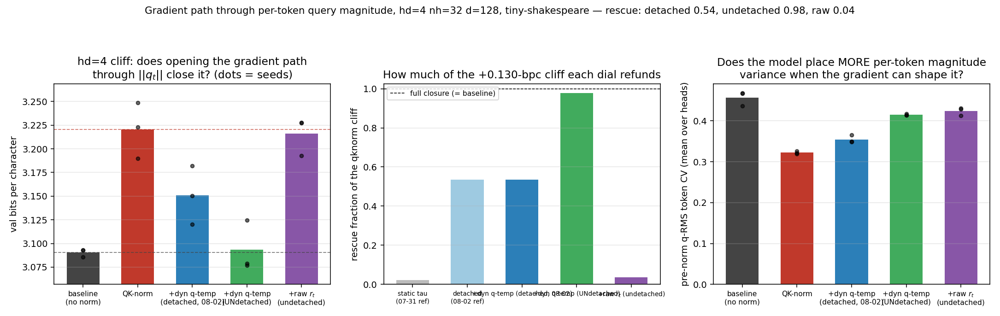

# Opening the gradient path through per-token query magnitude: the last component of the QK-norm hd=4 cliff

**Date:** 2026-08-06 · **Status:** done

## Hypothesis
2026-08-02 restored the pre-norm query RMS as a **detached** per-token temperature
(`tau = (r_t/EMA)^alpha`) and refunded 54% of the +0.130-bpc hd=4 QK-norm cliff. The
remaining 46% was conjectured to be the **gradient path**: the unnormalised baseline does
not merely read its query magnitudes, it gets to *learn where to place* large `||q_t||`,
and detaching severs exactly that. Prediction: undetaching `r_t` closes the rest of the
cliff; a raw `tau = r_t` arm (no EMA, no clamp, no alpha) checks whether the exact
parametrisation is a confound.

## Method
- Harness: byte-compatible with 2026-07-30/31/08-02 — 2-layer pre-norm char-GPT,
  d_model=128, ~424k params, tiny-shakespeare, AdamW 3e-3 cosine, 600 steps, val bpc on
  480 held-out blocks. Cliff config only: head_dim=4, n_head=32.
- Five arms x 3 paired seeds (identical shared-weight init per seed, verified by init
  signature; identical batch stream): `baseline` (no norm), `qknorm`,
  `dynq_detached` (exact 2026-08-02 arm, replication anchor),
  `dynq_undetached` (**the only change: `r_t` keeps its gradient**; EMA update still no_grad),
  `dynq_raw` (`tau = r_t` undetached, no EMA/clamp/alpha — algebraically the un-normalised
  query against the normalised key).
- Probes: attention entropy / top-1 / logit std, learned alphas, applied tau spread, and
  the mechanistic signature of the open channel: per-token pre-norm q-RMS CV.

## Result
**The gradient path was the missing piece — and the parametrisation is load-bearing.**

| arm | val bpc (3-seed mean) | rescue fraction of cliff |
|---|---|---|
| baseline (no norm) | 3.0904 | = 1.0 by definition |
| qknorm | 3.2205 | 0 |
| + static tau (2026-07-31 ref) | — | 0.02 |
| + dynq detached (2026-08-02 arm) | 3.1508 | 0.54 |
| + dynq **undetached** | **3.0934** | **0.98** |
| + raw `r_t` (undetached) | 3.2159 | 0.04 |

- Replication is exact: tonight's cliff (+0.13008 bpc) and detached rescue (0.5361) equal
  the 2026-08-02 numbers to the 5th decimal — the harness is deterministic.
- Undetached closes the cliff to +0.003 bpc of baseline (inside baseline's own 0.008 seed
  spread) and **beats the paired baseline outright in 2/3 seeds** (−0.014, +0.032, −0.009).
- The raw arm is a near no-op (0.04): merely *having* the magnitude back — the
  un-normalised query itself — refunds nothing. The rescue requires the relative, clamped,
  learnable-exponent form (`(r_t/EMA)^alpha`) AND the open gradient path. Neither alone
  suffices (detached-with-form = 0.54, raw-with-gradient = 0.04).
- Mechanistic signature confirms the mechanism: per-token q-RMS CV climbs from 0.322
  (qknorm) → 0.355 (detached) → **0.415 (undetached)**, back toward the baseline's 0.457.
  Given the gradient, the model actively re-creates per-token magnitude structure.
  Undetached alphas stay engaged (mean 0.98, never driven to 0).
- Mean sharpness stays capped as in the parents (entropy 0.886 vs qknorm 0.902 vs baseline
  0.736) — full closure without restoring average sharpness, confirming the 08-02 finding
  that the win is modulation, not temperature.

## Takeaway
The hd=4 QK-norm cliff story is complete: **QK-norm severs a learnable per-token sharpness
channel.** The decomposition ends at 2% static temperature + 54% readable per-token feature
+ 98% once the model can also learn where to place query magnitude — while naively
undoing the query normalisation (raw arm) refunds nothing, so the channel must be provided
in a normalised, relative form. Practical reading at tiny scale: QK-norm plus a
`(r_t/EMA)^alpha` query temperature with the gradient open is a strictly better
parametrisation of the same function class — it matches the unnormalised baseline at the
cliff while keeping QK-norm's win at larger head dims (2026-07-30). Caveats: 600-step
early-training regime, one config (hd=4, nh=32, d=128), 3 seeds, char-level
tiny-shakespeare. Next: does qknorm + undetached dynq preserve QK-norm's advantage at
hd=32 (do-no-harm held for detached; untested undetached), and does the composite beat
both parents across the full head-split sweep?

## Novelty check
- Verdict: novel (as a causal decomposition; components have partial prior art)
- Closest prior work: [Norm×Direction (arXiv 2506.21137)](https://arxiv.org/abs/2506.21137)
  restores the missing query norm in vision *linear* attention (norm carries information);
  [QK-norm (Henry et al. 2020)](https://aclanthology.org/2020.findings-emnlp.379.pdf) and
  descendants add learnable *static* scales; NaLaFormer (norm-aware linear attention) is
  the softmax-free cousin. Registry parents: 2026-07-30 / 07-31 / 08-02.
- How this differs: no published work isolates the **gradient path through `||q_t||`** as
  a causal variable (detached vs undetached on byte-identical paired inits), and the
  raw-restoration control showing form-dependence (0.98 vs 0.04) appears to be new.
- Note: arXiv/OpenAlex APIs returned 403 from tonight's sandbox; sources were verified via
  web search instead (queries and links recorded above).
