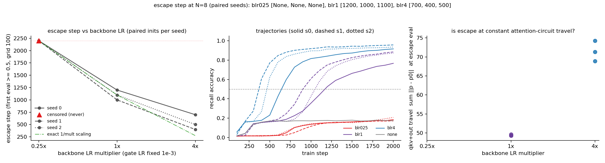

# MQAR backbone LR ratio: is the qkv circuit the clock that gates breakout?

**Date:** 2026-08-07 · **Status:** done

## Hypothesis
2026-08-03 found that for gate-LR multipliers m ≥ 1 the escape step pins to ~1000 regardless of gate speed, and inferred the binding constraint is the backbone (qkv/out/MLP/emb), not the gate. This is the causal test of that inference in the complementary direction: fix the gate LR at 1x and multiply ONLY the backbone LR by {0.25, 1, 4}. If the backbone is the clock, escape step should track backbone LR (roughly inverse scaling) where it was flat in gate LR; 4x may instead destabilize the plateau itself (the backlog flag).

## Method
- Architecture: the 2026-07-28/29/08-01/08-03 harness unchanged — 2-block elu+1 linear-attention transformer (d=64, 2 heads, 86k params) with a dense per-channel forget gate (`Linear(d_model -> h*dh)`, W init 0, bias init 3), decay-masked exact closed form.
- Task / dataset: synthetic MQAR, N=8 key-value pairs, key/val vocab 64, fresh batches every step, byte-identical generators to the parents.
- What is varied vs held fixed: ONLY the backbone parameters' AdamW learning rate (everything except the gate Linear), via a per-parameter-group multiplier m ∈ {0.25, 1, 4} on the base LR 1e-3 (gate LR fixed at 1x). Optimizer-side, so all gated arms share one init key: within a seed every blr* run is byte-identical at step 0 and sees identical batches — the exact mirror of 2026-08-03's design. `blr1` is an exact replication of 2026-08-03's `glr1` (= 2026-08-01's `dense`); `none` (vanilla, no gate) anchors the plateau. 3 paired seeds x 3 multipliers + anchor = 10 runs, 2000 steps each, eval grid 100. New readout: backbone travel (sum ||p − p0|| over qkv+out, and over the whole backbone) logged at every eval alongside gate travel.

## How to run
```bash
pip install -r requirements.txt
python run.py
```

## Result
**Confirmed, causally: the backbone is the clock — escape step tracks backbone LR in both directions, exactly where it was flat in gate LR.** Escape steps (first eval ≥ 0.5) across paired seeds:

| backbone LR | escape steps (s0/s1/s2) | mean final acc | qkv+out travel at escape | gate ‖W‖ at escape |
|---|---|---|---|---|
| 0.25x | censored / censored / censored | 0.188 | — | — |
| 1x | 1200 / 1000 / 1100 | 0.842 | 49.3 / 49.6 / 49.3 | 21.4 / 22.6 / 20.8 |
| 4x | 700 / 400 / 500 | 0.937 | 74.3 / 68.9 / 71.3 | 12.3 / 11.0 / 10.7 |
| vanilla | never | 0.174 | — | — |

Side-by-side with 2026-08-03 (same seeds, same inits, same data): multiplying the **gate** LR by 4 moved mean escape 1100 → 1000 (~one eval tick, inside seed spread); multiplying the **backbone** LR by 4 moves it 1100 → 533 (2.1x earlier, 3/3 seeds, no overlap between the arm distributions). Starving the backbone at 0.25x censors all 3 seeds at 2000 steps, sitting essentially on the vanilla plateau (0.188 vs 0.174) with only a slow late rise — versus gate-starving glr025, which still escaped 2/3 within budget. Both directions of the dose-response land on the backbone. No destabilization at 4x: no NaN, and final accuracy is *higher* (0.937 vs 0.842) — the backlog's plateau-degradation worry did not materialize.

Two quantitative nuances the travel readout adds. First, the scaling is **sublinear**: exact inverse scaling predicts escape ~275 at 4x; observed is 533. Second, travel-as-clock — refuted on the gate side in 2026-08-03 — is **refuted across arms on the backbone side too** (qkv+out travel at escape 49.4 → 71.5, 1.45x higher at 4x LR) *but is eerily tight within-arm*: blr1's three seeds escape at attention-circuit travel 49.29/49.63/49.29 (CV < 0.5%) while their escape steps span 1000–1200. Within a fixed LR, the attention circuit's distance-from-init predicts breakout better than the step count does; across LRs, a faster backbone escapes at more travel (consistent with extra diffusion or the sublinearity, not a fixed travel threshold). Bonus readout: at 4x the gate has traveled only half as far at escape (‖W‖ ~11 vs ~21.6) — breakout happens with a half-developed gate when the backbone runs faster, consistent with the gate as a door-opener (2026-07-29) rather than the pacing item.

`blr1` reproduced the parent to the eval tick (escapes 1200/1000/1100, final accs 0.767/0.885/0.873 — identical to 2026-08-03's glr1) and the vanilla anchor landed on the plateau to the 4th decimal (0.1738).



## Takeaway
The 2026-08-03 inference is now causal: the qkv/backbone circuit — not the gate — sets the clock for MQAR breakout in this gated linear-attention model. The full picture across 08-01/08-03/08-07: the gate is necessary (freeze/starve it and breakout is delayed or dies) but never pacing (boosting it does nothing for m ≥ 1); the backbone is pacing in both directions (starve → censored, boost → 2.1x earlier at 4x with *better* final accuracy and no instability). Sublinearity (2.1x, not 4x) plus the within-arm travel constancy suggest the natural next split: scale gate and backbone LR *together* by 4 — if escape then scales ~exactly inversely, the residual sublinearity at fixed gate LR is the gate lagging behind the circuit it serves (added to backlog as `mqar-joint-lr-scaling`).

## Novelty check
- Verdict: novel (as a micro-question; the harness and question are internal follow-ups)
- Closest prior work: same neighborhood as 2026-08-03 — [Learning to Remember, Learn, and Forget in Attention-Based Models (2602.09075)](https://arxiv.org/abs/2602.09075) (gated attention, no per-subsystem LR causal probing); [Breaking through the Learning Plateaus of In-context Learning (2309.06054)](https://arxiv.org/html/2309.06054v3) (plateau-escape mechanics, not subsystem-resolved); muP/per-layer-LR literature sets ratios from width theory, not as a causal probe of which named subsystem rate-limits a phase transition. `scripts/novelty_check.py` (arXiv + OpenAlex) returned 1 hit per query, none on point; registry grep: no prior backbone-LR row.
- How this differs: the complementary arm of the first paired-init, optimizer-side, per-subsystem LR dose-response on a known phase transition — together the two experiments causally localize the rate-limiting subsystem, which neither could alone.
