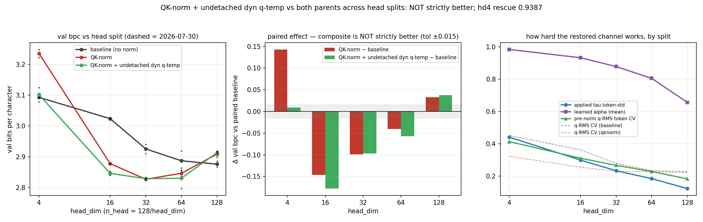

# Is QK-norm + undetached dynamic query temperature a strictly better parametrisation? The full head-split sweep

**Date:** 2026-08-11 · **Status:** done

## Hypothesis
2026-08-06 closed the hd=4 QK-norm cliff (98% rescue) with an undetached per-token query
temperature `tau = clamp(r_t/EMA)^alpha`, but only at the cliff config, and the detached
variant had cost +0.011 bpc at hd=32 (2026-08-02) — so "strictly better parametrisation"
was an open claim about the whole curve. Tonight: rerun the full 2026-07-30 head-split
sweep (hd 4/16/32/64/128 at d_model=128) with three arms on paired inits and a shared
batch stream — baseline (no norm), plain QK-norm, and the composite (QK-norm + undetached
dynq). Strictly-better requires the composite to match or beat BOTH parents at every
split (tolerance ±0.015, the parent sweep's qknorm seed spread).

## Method
- Harness byte-compatible with 2026-07-30/31/08-02/08-06: 2-layer pre-norm char-GPT,
  d_model=128, ~424k params, tiny-shakespeare, AdamW 3e-3 cosine, 600 steps, val bpc on
  480 held-out blocks. 5 head splits x 3 arms x 2 paired seeds = 30 runs, ~19 min CPU.
- Composite arm is exactly the 08-06 winner: per-head RMS-norm on q,k + per-channel gains,
  then normalised q scaled by `tau = clamp(r_t/EMA, 1/8, 8)^alpha` with the gradient path
  through the pre-norm q-RMS `r_t` OPEN (EMA update no_grad; alpha per head, init 1).
- Replication anchors: baseline and qknorm arms are re-runs of 2026-07-30's exact recipe
  and seeds; probes: attention entropy/top-1/logit std, learned alphas, applied tau
  token-std, pre-norm q-RMS token CV.

## Result
**NOT strictly better than both parents — but it strictly dominates plain QK-norm.
The composite fixes QK-norm's small-head pathology and inherits its single-head one.**

| head_dim (n_head) | baseline | qknorm | composite | comp − base | comp − qknorm | verdict |
|---|---|---|---|---|---|---|
| 4 (32) | 3.0929 | 3.2359 | 3.1017 | +0.0088 | **−0.1342** | OK (cliff closed, 94% rescue) |
| 16 (8) | 3.0237 | 2.8775 | **2.8458** | −0.1778 | **−0.0316** | OK (beats both) |
| 32 (4) | 2.9254 | 2.8268 | 2.8287 | −0.0967 | +0.0019 | OK (ties qknorm) |
| 64 (2) | 2.8868 | 2.8461 | **2.8300** | −0.0568 | −0.0161 | OK (beats both) |
| 128 (1) | **2.8758** | 2.9087 | 2.9132 | +0.0373 | +0.0045 | **FAILS** (inherits qknorm's tax) |

- Replication is bit-exact: all 10 baseline/qknorm (split, arm) means land on the
  2026-07-30 numbers to the 5th decimal (delta 0.00000 everywhere) — same seeds, same
  batch stream, fully deterministic harness.
- **Vs plain QK-norm the composite is a Pareto move:** never worse than +0.005 (inside
  noise), and better by −0.134/−0.032/−0.016 at hd=4/16/64. If you are using QK-norm at
  this scale, adding the undetached channel costs nothing and removes the small-head
  pathology entirely.
- **The hd=4 closure survives the sweep context:** 94% rescue at 2 seeds (08-06: 98% at
  3 seeds), landing +0.009 of baseline — inside tolerance.
- **The hd=128 (single-head) failure is informative:** QK-norm's tax there (+0.033) is
  NOT a per-token query-magnitude phenomenon. The model even says so itself — learned
  alphas fall monotonically with head_dim (0.98 → 0.93 → 0.88 → 0.81 → 0.66) and applied
  tau token-std shrinks 0.44 → 0.12: the channel dials itself down where it cannot help,
  but partial disengagement cannot recover the baseline. Whatever QK-norm destroys at
  nh=1 (suspects: key-side magnitude, or the per-channel-gain geometry at full width),
  it is a different casualty than the one the dynq channel restores.
- The U-curve survives with its optimum unmoved: composite interior optimum at hd=32
  (2.8287), statistically tied with plain qknorm's global best (2.8268, inside seed
  spread). The composite does not unlock a new best point; it widens the basin —
  hd 16/32/64 now sit within 0.016 of each other vs 0.020 spread under qknorm alone.
- Mechanistic coherence: composite q-RMS token CV tracks baseline's decline (0.41 → 0.18)
  while plain qknorm flattens it — with the gradient open, per-token magnitude structure
  is re-created in proportion to how much the split needs it.

## Takeaway
"Strictly better parametrisation" is settled: **of QK-norm, yes; of attention, no.**
The undetached per-token query temperature is a free upgrade wherever QK-norm is used
(multi-head), erasing its worst failure mode at zero cost elsewhere — but it does not
convert QK-norm into a dominant choice, because the single-head tax has a different
mechanism that the query-magnitude channel cannot reach and knows it cannot reach
(alpha disengagement). Practical rule at tiny scale: multi-head → QK-norm + undetached
dynq; single head → no norm. Caveats: 600-step early-training regime, 2 seeds, one
d_model (128), char-level tiny-shakespeare; hd=64 composite seed spread is wide (0.067).
Next: the hd=128 tax now has a suspect list — a key-side r_t channel (08-02 showed
key-side restoration HURT at hd=4; it may HELP at nh=1) or gain-geometry; and
qknorm-ucurve-width-scaling (backlog) asks whether the hd=32 optimum tracks d_model.

## Novelty check
- Verdict: novel (as a paired-init composite-vs-both-parents sweep; components have
  partial prior art)
- Closest prior work: [QK-norm (Henry et al. 2020, arXiv 2010.04245)](https://arxiv.org/abs/2010.04245)
  adds a learnable *static* scale g; [Lp-QKNorm (arXiv 2602.05006)](https://arxiv.org/html/2602.05006v1)
  generalises the norm itself; [NaLaFormer (arXiv 2506.21137)](https://arxiv.org/html/2506.21137v1)
  restores query-norm information in *linear* attention; QK-norm folklore
  ([Mukherjee](https://ishanjmukherjee.github.io/qk-norm), [Taylor](https://rossjtaylor.com/blog/qk-norm-and-the-curious-case-of-logit-drift/))
  treats it as a free lunch — none sweeps head splits with a per-token learnable
  temperature or reports the small-head/single-head asymmetry. Registry parents:
  2026-07-30 / 07-31 / 08-02 / 08-06.
- How this differs: first do-no-harm test of the restored channel across the full head
  split at paired inits; the alpha-disengagement-vs-head_dim curve and the
  "fixes-the-cliff-but-not-the-single-head-tax" dissociation appear to be new.
- Note: arXiv/OpenAlex APIs returned 403 from tonight's sandbox (as on 08-06); sources
  verified via web search (queries: "QK-norm learnable per-token query temperature
  attention head dimension sweep", "query norm restoration dynamic temperature attention
  QK norm").
