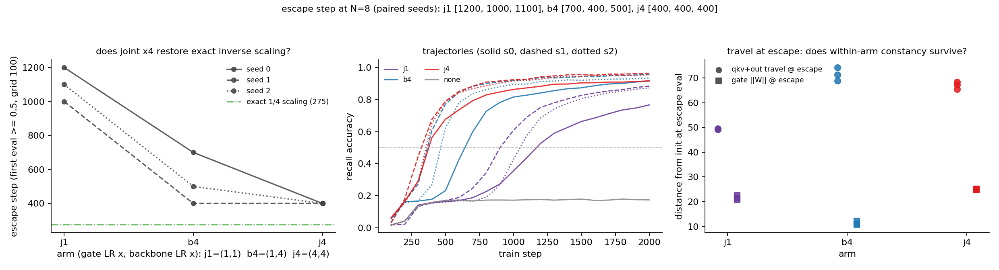

# MQAR joint LR scaling: is the residual sublinearity the gate lagging, or the optimizer?

**Date:** 2026-08-13 · **Status:** done

## Hypothesis
2026-08-07 made the backbone-as-clock story causal but left a quantitative anomaly: backbone x4 moved mean escape 1100 → 533, not the ~275 exact inverse scaling predicts, and at escape the gate had traveled only half its usual distance (‖W‖ ~11 vs ~21.6). Two candidate explanations the parent could not separate: (a) **gate-lag** — the gate still learning at 1x becomes a partially binding serial dependency when the backbone runs 4x; (b) **optimizer-side** — Adam's approximate LR-time-reparametrization is broken by weight decay / gradient noise / curvature, so no uniform speedup yields exact inverse scaling. Decisive arm: scale gate AND backbone LR together by 4 on the same paired inits. Joint x4 at ~275-300 → (a); joint x4 at ~533 → (b).

## Method
- Architecture: the 2026-07-28/29/08-01/08-03/08-07 harness unchanged — 2-block elu+1 linear-attention transformer (d=64, 2 heads, 86k params) with a dense per-channel forget gate (W init 0, bias init 3), decay-masked exact closed form.
- Task / dataset: synthetic MQAR, N=8 pairs, key/val vocab 64, fresh batches every step, byte-identical generators to the parents.
- What is varied vs held fixed: ONLY the AdamW per-parameter-group LR pair (gate mult, backbone mult): `j1` = (1,1), `b4` = (1,4), `j4` = (4,4), base LR 1e-3, plus the vanilla `none` anchor. Optimizer-side only, so all gated arms share one init key: within a seed every run is byte-identical at step 0 and sees identical batches. `j1` exactly replicates 08-07's `blr1` (= 08-03 `glr1` = 08-01 `dense`); `b4` exactly replicates 08-07's `blr4`. 3 paired seeds x 3 arms + anchor = 10 runs, 2000 steps, eval grid 100 (kept for cross-experiment comparability). ~15 min CPU.

## How to run
```bash
pip install -r requirements.txt
python run.py
```

## Result
**Both suspects are real — the gate-lag is confirmed but only explains ~43% of the sublinearity; joint x4 still misses exact inverse scaling, so the residual is optimizer-side.** Escape steps (first eval ≥ 0.5) across paired seeds:

| arm (gate, backbone) | escape steps (s0/s1/s2) | mean | mean final acc | qkv+out travel @ escape | gate ‖W‖ @ escape |
|---|---|---|---|---|---|
| j1 (1x, 1x) | 1200 / 1000 / 1100 | 1100 | 0.842 | 49.29 / 49.63 / 49.29 | 21.6 |
| b4 (1x, 4x) | 700 / 400 / 500 | 533 | 0.937 | 71.5 | 11.3 |
| j4 (4x, 4x) | **400 / 400 / 400** | 400 | 0.946 | 65.5 / 68.3 / 67.2 | 24.9 |
| vanilla | never | — | 0.174 | — | — |

Three findings. **First, the gate-lag is causal:** letting the gate keep pace moves escape 533 → 400, and the improvement is clean on paired inits — j4 escapes at or before b4 in every seed (700→400, 400→400, 500→400), with no instability and the best final accuracy of any arm in the whole 08-01/08-03/08-07 series (0.946). The travel readout confirms the mechanism: at escape, j4's gate is fully developed (‖W‖ ~24.9, back at/above j1's ~21.6) where b4's was half-built (~11.3). **Second, exact inverse scaling is still NOT restored:** the prediction is 250-300 (j1 seeds /4); j4 sits at 400 in all three seeds, and this is not grid rounding — at step 300 the j4 trajectories read 0.292/0.447/0.295, all below threshold. In log terms the gate-lag explains log(533/400)/log(533/275) ≈ 43% of the sublinearity; a ~1.45x optimizer/curvature-side slowdown survives uniform x4 scaling of every parameter. **Third, an unexpected constancy inversion:** at 1x the *attention travel* at escape is eerily constant across seeds (49.29/49.63/49.29, CV < 0.5%) while the escape *step* spans 1000-1200; at joint x4 the escape *step* is exactly constant (400/400/400 — seed spread collapses to zero, vs 300-step spread in b4) while the travel now varies (65.5-68.3, CV ~2%). Uniform LR scaling appears to trade travel-determinism for time-determinism. Across arms, travel-at-escape rises with any x4 (49.4 → 71.5 backbone-only, 67.0 joint), so travel-as-clock stays refuted across arms.

Replications: `j1` reproduced 08-07's blr1 bit-exactly (escapes, final accs 0.767/0.885/0.873, and travel 49.2908/49.6325/49.2880 to the 4th decimal); `b4` reproduced blr4 (700/400/500); the vanilla anchor landed on the plateau at 0.174 (parent: 0.1738).



## Takeaway
The 08-07 sublinearity decomposes into two real parts: a gate that lags the circuit it serves when only the backbone accelerates (~43%, now fixed by matched speeds — and worth remembering as a free win: joint scaling is what a single global LR does anyway), and a residual ~1.45x slowdown that survives uniform LR scaling and therefore lives in the optimizer/curvature side (Adam's time-reparametrization broken by weight decay, gradient noise, or the plateau's own geometry — wd=0.01 is a named suspect since decay per step is LR-coupled). The seed-spread collapse at joint x4 (400/400/400) is the most intriguing loose end: escape timing becomes deterministic exactly when all parameter groups share one clock. Named next step (added to backlog as `mqar-joint-lr-wd-decouple`): rerun j4 with wd=0 vs wd-compensated (wd/4) arms — if wd=0 restores ~300, the residual sublinearity is the weight-decay coupling; also test whether the step-determinism survives.

## Novelty check
- Verdict: novel (as a micro-question; the harness and question are internal follow-ups)
- Closest prior work: [What Happens During the Loss Plateau? Understanding Abrupt Learning in Transformers (2506.13688)](https://arxiv.org/html/2506.13688v2) (plateau/abrupt-learning mechanics, not subsystem-resolved LR causal probing); [Fast Escape, Slow Convergence (2511.18661)](https://arxiv.org/html/2511.18661v1) (escape-dynamics theory, single LR); [Cumulative Learning Rate Adaptation (2508.05408)](https://arxiv.org/html/2508.05408v1) (path-based LR schedules — adjacent to our travel-as-clock readouts but not per-subsystem); muP/per-layer-LR literature sets ratios from width theory, not as a decomposition of sublinear escape scaling. arXiv/OpenAlex APIs 403 from the sandbox (as on 08-06/08-11); web search used instead. Registry grep: no prior joint-LR row.
- How this differs: completes the 08-03/08-07 per-subsystem LR dose-response triad with the joint arm, decomposing the observed sublinear escape scaling into a subsystem-lag component and an optimizer-side residual on byte-identical paired inits — a decomposition neither parent could make alone.
