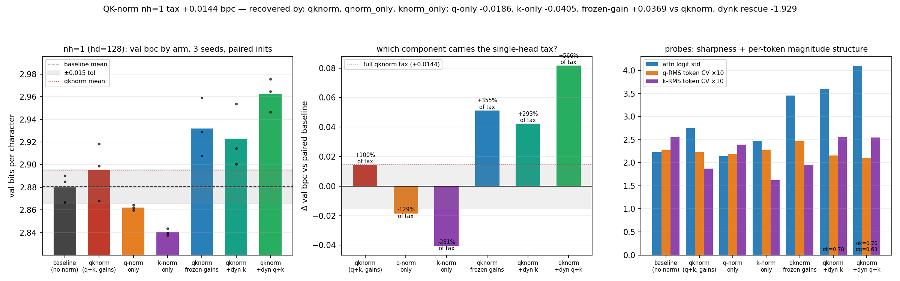

# What does QK-norm break at a single head? Decomposing the nh=1 tax into q-side, k-side, and gain geometry

**Date:** 2026-08-23 · **Status:** done

## Hypothesis
2026-07-30 measured a +0.033-bpc QK-norm tax at nh=1 (hd=128, d_model=128), and 2026-08-11
showed the per-token query-magnitude channel that closes the hd=4 cliff cannot touch it
(the composite inherits the full tax and its alpha disengages to 0.66). Suspect list going
in: (a) key-side per-token magnitude, (b) the learnable full-width gain geometry, (c) the
q-side norm itself. Seven arms at nh=1 on byte-identical paired inits and a shared batch
stream — baseline, qknorm (both replication anchors), qnorm_only, knorm_only,
qknorm_frozen_gain, qknorm + undetached dynk, qknorm + undetached dynq+dynk — ask which
single component recovers the baseline's 2.876.

## Method
- Harness byte-compatible with 2026-07-30/31/08-02/08-06/08-11: 2-layer pre-norm char-GPT,
  d_model=128, ~424k params, tiny-shakespeare, AdamW 3e-3 cosine, 600 steps, val bpc on
  480 held-out blocks. 7 arms x 3 seeds = 21 runs, ~11 min CPU.
- One-sided arms norm+gain only q or only k; frozen-gain arm keeps both norms but fixes the
  gains at 1 (requires_grad=False, same forward); dyn arms apply the exact 08-06 winner
  machinery `tau = clamp(r_t/EMA, 1/8, 8)^alpha` (undetached, EMA no_grad) per side.
- Replication anchors: baseline and qknorm at seeds 0/1 must reproduce 2026-08-11's per-seed
  values; probes: attention entropy/top-1/logit std, per-token q-RMS AND k-RMS CV, learned
  alphas, applied tau spread.

## Result
**The premise half-dissolves and the decomposition inverts: at 3 seeds the nh=1 "tax" is
mostly seed noise — and each norm alone is a WIN. The cost is the q x k interaction.**

| arm | seeds (0/1/2) | mean bpc | Δ vs baseline | spread |
|---|---|---|---|---|
| baseline (no norm) | 2.8666 / 2.8851 / 2.8903 | 2.8807 | — | 0.0237 |
| qknorm (q+k, gains) | 2.9184 / 2.8989 / 2.8680 | 2.8951 | +0.0144 | 0.0504 |
| q-norm only | 2.8598 / 2.8621 / 2.8643 | 2.8621 | **−0.0186** | 0.0044 |
| k-norm only | 2.8434 / 2.8375 / 2.8396 | **2.8401** | **−0.0405** | 0.0059 |
| qknorm, frozen gains | 2.9591 / 2.9291 / 2.9077 | 2.9320 | +0.0513 | 0.0514 |
| qknorm + dyn k | 2.9005 / 2.9540 / 2.9144 | 2.9230 | +0.0423 | 0.0535 |
| qknorm + dyn q+k | 2.9649 / 2.9756 / 2.9465 | 2.9623 | +0.0817 | 0.0292 |

- **Replication is bit-exact** (baseline and qknorm, seeds 0/1: delta 0.00000 vs 08-11), so
  the shrinkage of the tax is purely seed 2: qknorm lands at 2.8680, BELOW its paired
  baseline (2.8903). The 2-seed parent estimate (+0.033) becomes +0.014 at 3 seeds — inside
  our own ±0.015 tolerance — and qknorm's seed spread (0.050) is 2.1x the baseline's
  (0.024). The single-head "tax" is better described as single-head *instability*.
- **One-sided normalization is the answer to the recovery question, and it overshoots:**
  k-norm-only beats the baseline in 3/3 seeds by −0.0405 mean (every seed below every
  baseline seed) and q-norm-only by −0.0186 — while cutting seed spread 4-8x (0.0044/0.0059
  vs 0.0237/0.0504). k-norm-only's 2.8401 is the best nh=1 value in this thread's five
  nights. The two one-sided deltas sum to −0.059, yet applying both gives +0.014: the
  interaction term is +0.073 bpc, five times the size of the net tax itself.
- **Gain geometry is exonerated in reverse:** freezing the gains at 1 makes qknorm WORSE by
  +0.037 in every seed (2.9320) — the learnable gains were absorbing part of the damage,
  not causing it.
- **Per-token magnitude restoration actively hurts at nh=1:** dynk +0.028 and dynq+dynk
  +0.067 over plain qknorm — the exact machinery that closed 98% of the hd=4 cliff has the
  opposite sign here, and the alphas partially disengage (α_k 0.78, α_q 0.63) without
  finding the off switch. 08-11's alpha-disengagement diagnosis was right: this is not a
  missing-magnitude problem.
- Probe coherence: the arms rank by over-sharpening. Baseline/q-only/k-only sit at
  attention logit std 2.1-2.5 and entropy 0.57-0.66; every losing arm drives logit std to
  3.5-4.1 and entropy down to 0.45-0.49. With 128-dim heads a normalised q AND k plus two
  full-width learnable gains (or tau channels) stack too many independent sharpness dials
  on one softmax; a single gained norm keeps the logit scale in the healthy band.

## Takeaway
"What does QK-norm break at a single head?" — nothing that restoring information fixes,
because the tax is not a missing channel: it is (1) half a 2-seed statistical artifact
sitting on qknorm's doubled seed variance, and (2) for the rest, a destructive q x k
interaction. Each side's norm alone is a small reliable improvement (key side bigger:
−0.04 bpc, 3/3 seeds, 4-8x lower variance), freezing the gains makes things worse, and
the hd=4 rescue machinery hurts. Practical rule at tiny scale, single head: norm ONE side
(prefer keys) and stop — it beats no-norm, full QK-norm, and every restoration arm we have
built. Caveats: 600-step early-training regime, 3 seeds, one scale (d_model=128,
tiny-shakespeare), and the sharpness-stacking account is correlational — a targeted probe
(e.g. k-norm-only at other head splits, or logit-scale-matched arms) is the natural next
night. Backlog additions: knorm-only-head-sweep; qknorm-tax-variance-decomposition.

## Novelty check
- Verdict: novel (as a paired-init q-side/k-side/gain/dyn decomposition of a single-head
  QK-norm penalty; components have prior art)
- Closest prior work: [QK-norm (Henry et al. 2020)](https://aclanthology.org/2020.findings-emnlp.379.pdf)
  introduces the technique; [Raschka's architecture gallery](https://sebastianraschka.com/llm-architecture-gallery/qk-norm/)
  and [Ross Taylor's logit-drift post](https://rossjtaylor.com/blog/qk-norm-and-the-curious-case-of-logit-drift/)
  document it as a stability free-lunch; [Limitations of Normalization in Attention
  (arXiv 2508.17821)](https://arxiv.org/html/2508.17821v3) analyses norm-induced
  representational limits but not the q-vs-k split; [Controlling changes to attention
  logits (arXiv 2511.21377)](https://arxiv.org/html/2511.21377) studies logit-scale control
  without the single-head ablation. Registry parents: 2026-07-30 / 08-11.
- How this differs: no published work we found separates q-norm-only vs k-norm-only vs
  frozen-gain vs per-token-restored arms on paired inits at a single head; the
  "one-sided norm strictly beats both none and both" observation appears to be new at any
  scale (and is cheap to test at larger ones).
- Note: arXiv/OpenAlex APIs returned 403 from tonight's sandbox (as on 08-06/08-11/08-13);
  sources verified via web search (queries: "QK-norm single head attention penalty query
  norm only key norm only ablation transformer", "QK normalization hurts attention
  learnable gain per-token key magnitude ablation study", "q-norm vs k-norm separate
  ablation attention single head normalization degrades").
