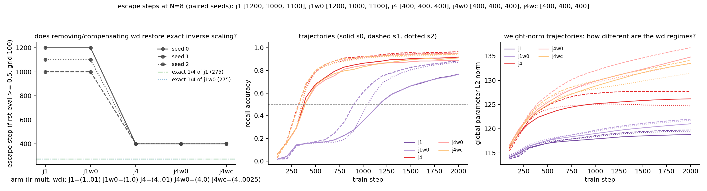

# MQAR joint-LR sublinearity: is the ~1.45x residual the weight-decay/LR coupling?

**Date:** 2026-08-26 · **Status:** done (clean negative — the named suspect is exonerated)

## Hypothesis
2026-08-13 decomposed the sublinear escape scaling under uniform x4 LR (j4 escapes 400/400/400 where exact inverse of j1's ~1100 predicts ~275) into gate-lag (~43%, log) plus a ~1.45x unattributed residual, and named AdamW's LR-coupled decoupled weight decay as the suspect: the per-step shrink is `lr * wd * p`, so a 4x LR decays weights 4x harder per step and the LR dial is not a pure time-rescaling of the drift. If the decay term is the residual, removing wd (or compensating it to wd/4 at x4) should pull the joint-x4 escape toward ~275-300.

## Method
- Architecture: the 2026-08-13 harness byte-for-byte — 2-block decay-masked elu+1 linear attention (dense per-channel gate, bias init 3.0), d_model 64, 2 heads, ~120k params; AdamW base lr 1e-3 with per-parameter-group multipliers.
- Task / dataset: MQAR N=8 pairs (key/val vocab 64), fresh batches every step, generators byte-identical to 2026-07-26 through 2026-08-13; 512-sequence held-out eval, eval grid 100, escape = first eval ≥ 0.5, 2000-step cap.
- What is varied vs held fixed: 5 arms x 3 paired seeds = 15 runs, all sharing byte-identical inits and data streams per seed; only the optimizer triple (gate LR mult, backbone LR mult, wd) varies. j1 = (1x, 1x, .01) and j4 = (4x, 4x, .01) are in-run replication anchors of 08-13; j1w0 = (1x, 1x, 0), j4w0 = (4x, 4x, 0) the decisive wd-free pair; j4wc = (4x, 4x, .0025) matches j1's per-step decay `lr*wd`. New readout: global parameter L2 norm along the trajectory, confirming the wd dial is mechanically live.

## Result
**Weight decay is fully exonerated — escape timing is invariant to wd in every arm, to the seed level.** Escape steps: j1 [1200, 1000, 1100], j1w0 [1200, 1000, 1100] (per-seed IDENTICAL — wd=0 is an exact no-op at 1x on the eval grid), j4 [400, 400, 400] (08-13 replication exact), j4w0 [400, 400, 400], j4wc [400, 400, 400]. Every escape-ratio mean — j1/j4, j1w0/j4w0, j1w0/j4wc, j1/j4wc — is the same 2.75, nowhere near the 4.0 that wd-as-residual predicts (`escape_ratio_means` in `results.json`). The wd dial is demonstrably live where it should be: weight norms separate cleanly by regime (panel 3; j4 ends ~126 vs j4w0 ~135) and wd=0.01 buys a small final-acc edge at x4 (0.9458 vs 0.9297) — it just has zero effect on when the recall circuit breaks out. The 400/400/400 step-determinism at joint x4 survives all three wd regimes (9/9 runs), and travel-at-escape constancy holds within every arm (attn ~49.3-49.8 at 1x, ~65.5-68.8 at x4; gate ‖W‖ ~21.6 at 1x, ~25.0 at x4 — both wd-invariant).

## Takeaway
The ~1.45x residual sublinearity of escape time under uniform LR scaling is NOT AdamW's LR-coupled decay term — with wd removed entirely the joint-x4 run still escapes at exactly 400, and the wd-free j1w0/j4w0 ratio is exactly the wd=0.01 ratio (2.75). A counting argument in hindsight says the idealized decay term should cancel (per unit progress, steps x per-step decay is LR-invariant), and the data agrees to the seed level; what does NOT rescale is stochastic-gradient diffusion per unit drift (4x larger at 4x LR) and plateau/curvature geometry — now the only remaining suspects. Extra negative for free: on this task wd contributes nothing to plateau escape even at 1x (contrast grokking, where our 2026-07-25 sweep showed WD is the delay dial) — MQAR breakout and grokking are not the same kind of plateau. Next: the noise account is testable by varying batch size at fixed LR (diffusion scales 1/B while drift is fixed) — if escape-step ratios track batch size the way they refuse to track wd, the residual is diffusion; also worth checking whether the eerie step-determinism at x4 (9/9 at exactly 400) survives batch-size changes, since the noise account predicts it should NOT.

## Novelty check
- Verdict: novel (as a measured decomposition; the theory frame is prior art)
- Closest prior work: [How to set AdamW's weight decay as you scale model and dataset size](https://arxiv.org/pdf/2405.13698) (the `1/(lr*wd)` timescale frame — theory + LM loss curves, not plateau-escape timing); [Robust Layerwise Scaling Rules by Proper Weight Decay Tuning](https://arxiv.org/html/2510.15262) and [Correction of Decoupled Weight Decay](https://arxiv.org/html/2512.08217v1) (wd/LR coupling corrections at scale); own registry 2026-08-07/08-13 (the sublinearity being decomposed) and 2026-07-25_grokking-weight-decay-phase (the contrast case where wd IS the delay dial).
- How this differs: nobody we can find measures whether the wd/LR coupling shifts *breakout time* on an associative-recall plateau with paired byte-identical inits; the seed-exact invariance result (wd a per-seed no-op on escape while visibly moving weight norms and final acc) appears unreported.
