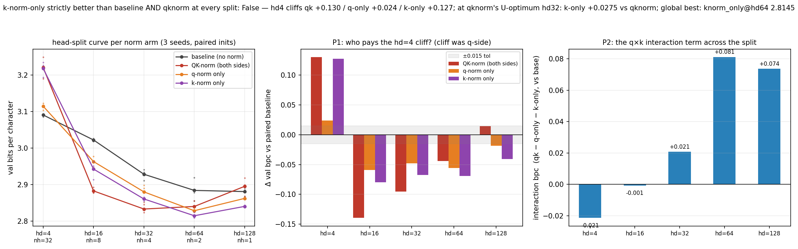

# Is one-sided key-norm the strictly-better attention norm? k-norm-only vs QK-norm across the full head split

**Date:** 2026-08-30 · **Status:** done

## Hypothesis
2026-08-23 found that at a single head (hd=128), norming ONE side beats norming none and
both: k-norm-only −0.041 bpc vs baseline (3/3 seeds, 4-8x lower variance) while full
QK-norm pays a +0.073 q x k interaction term. Nobody checked multi-head. Tonight the four
norm arms (baseline / qknorm / qnorm_only / knorm_only) run across the full iso-parameter
head-split family n_head x head_dim = 128, 3 seeds, byte-identical paired inits.
Predictions registered up front: (P1) the hd=4 cliff is q-side (per the 08-02/06 dynq
rescue), so k-norm-only should show NO cliff while q-norm-only inherits it; (P2) the
one-sided arms converge toward full qknorm as heads multiply; (P3) open verdict — does
k-norm-only beat full qknorm at qknorm's own U-optimum (hd=32) and both parents at every
split, the "strictly better" claim the 08-11 composite failed?

## Method
- Harness byte-compatible with 2026-07-30/31/08-02/06/11/23: 2-layer pre-norm char-GPT,
  d_model=128, ~424k params, tiny-shakespeare, AdamW 3e-3 cosine, 600 steps, val bpc on
  480 held-out blocks. 4 arms x head_dim {4,16,32,64} x 3 seeds fresh (48 runs, ~14 min);
  hd=128 (nh=1, all 4 arms x 3 seeds) imported from the deterministic 2026-08-23 run after
  LIVE verification — two rerun (arm, seed) pairs at hd=128 tonight matched 08-23 to
  Δ = 0.00000 (identical env: py 3.11.15 / torch 2.13.0 / numpy 2.4.4), so the import is
  bit-exact, not assumed. Total ~17 min CPU.
- One-sided arms norm+gain only q or only k, same flag layout and forward math as the
  08-23 arms of the same name; paired inits enforced by an init-signature assert.
- Probes: attention logit std, normalized entropy, top-1 weight, per-token q/k RMS CV.

## Result
**No strict winner exists — the best norm flips with head width, and the hd=4 cliff
changes sides: it follows the KEY norm, not the query norm.**

| | hd=4 (nh=32) | hd=16 (nh=8) | hd=32 (nh=4) | hd=64 (nh=2) | hd=128 (nh=1) |
|---|---|---|---|---|---|
| baseline | 3.0904 | 3.0219 | 2.9281 | 2.8839 | 2.8807 |
| qknorm | 3.2205 (+0.130) | **2.8825** (−0.139) | **2.8329** (−0.095) | 2.8399 (−0.044) | 2.8951 (+0.014) |
| q-norm only | 3.1144 (+0.024) | 2.9628 (−0.059) | 2.8799 (−0.048) | 2.8282 (−0.056) | 2.8621 (−0.019) |
| k-norm only | 3.2178 (+0.127) | 2.9423 (−0.080) | 2.8604 (−0.068) | **2.8145** (−0.069) | **2.8401** (−0.041) |

- **P1 REFUTED — the cliff swaps sides.** At hd=4, k-norm-only pays essentially the full
  qknorm cliff (+0.127 vs +0.130; per-seed 3.226/3.234/3.193 ≈ qknorm's 3.223/3.249/3.190)
  while q-norm-only is nearly free (+0.024). The one-sided decomposition localizes the
  tiny-head cliff to the KEY norm — yet 08-06 closed 98% of that same cliff by restoring
  the per-token QUERY magnitude on top of both norms (and 08-02 found key-side restoration
  *hurts*). Reconciliation: the q-magnitude channel is a *compensation route*, not the
  causal side — with keys unit-RMS, a learnable per-token query scale can re-encode the
  destroyed key-side information, but what the norm destroys at hd=4 lives on the keys.
- **P2 half-holds, and adds the missing mechanism:** the q x k interaction term is ~0 at
  hd 4/16 (−0.021/−0.001), then grows monotonically with head width: +0.021/+0.081/+0.074
  at hd 32/64/128. The 08-23 "sharpness-stacking" pathology is a wide-head phenomenon;
  at many small heads the two norms are additive and both help.
- **P3 REFUTED — full QK-norm keeps its crown at mid splits.** At its U-optimum hd=32,
  qknorm beats k-only by 0.0275 (3/3 paired seeds; also 3/3 at hd=16). The crossover is
  clean: qknorm wins hd 16-32, k-only wins hd 64-128 (3/3 paired seeds each), q-only wins
  hd=4. No arm is within tolerance of best everywhere → `strictly_better_verdict: false`.
- **New thread best anyway:** k-norm-only at hd=64 lands 2.8145 (2.811/2.824/2.809) —
  better than qknorm at its own optimum (2.8329 tonight, 2.827 in 08-11) and the best
  value in this thread's seven nights, with 4x lower seed spread than baseline (0.015 vs
  0.064).
- Variance echo of 08-23: k-norm-only has the smallest seed spread of all arms at hd 32/64/128
  (0.012/0.015/0.006) while qknorm's spread balloons exactly where it loses (0.059 at hd=4,
  0.050 at hd=128).
- Probe coherence: k-norm-only holds attention logit std in the 2.0-2.8 band across all
  splits while cutting the k-RMS token CV roughly in half; qknorm at hd=4 over-flattens
  (logit std 1.27, entropy 0.90) exactly as in 07-30.

## Takeaway
"Norm one side and stop" (08-23) is real but not universal — it is the wide-head rule.
The full picture is a phase diagram in head width: at many tiny heads (hd=4) norms hurt
and the damage rides the key side; at mid splits (hd 16-32) the two norms are additive
and full QK-norm is best; at wide heads (hd ≥ 64) the q x k interaction turns destructive
(+0.07-0.08 bpc) and dropping the query norm strictly helps — k-norm-only at hd=64 is the
best attention configuration this thread has found (2.8145, beating qknorm's optimum by
0.018). The thread's cliff story needs a rewrite: the hd=4 casualty is key-side, and the
celebrated dynq rescue was compensation through the surviving query channel. Caveats:
600-step early-training regime, one scale (d_model=128, tiny-shakespeare), 3 seeds,
one task. Next: why does the key side matter at hd=4 — magnitude or direction? (backlog:
hd4-kside-cliff-mechanism); and does the hd≥64 k-only win survive longer training?

## Novelty check
- Verdict: novel (follow-up decomposition of our own 08-23 finding; the one-sided-norm x
  head-split phase diagram appears unpublished)
- Closest prior work: [QK-norm (Henry et al. 2020)](https://aclanthology.org/2020.findings-emnlp.379.pdf)
  normalizes both sides; [Raschka's architecture gallery](https://sebastianraschka.com/llm-architecture-gallery/qk-norm/)
  and the [attention-variants guide](https://magazine.sebastianraschka.com/p/visual-attention-variants)
  survey QK-norm as an all-or-nothing stability trick; [HybridNorm (arXiv 2503.04598)](https://arxiv.org/pdf/2503.04598)
  mixes norm placements at block level, not q-vs-k side; [Enhanced QKNorm with the Lp norm](https://www.researchgate.net/publication/400505110_Enhanced_QKNorm_normalization_for_neural_transformers_with_the_Lp_norm)
  varies the norm's exponent, again on both sides. Registry parents: 2026-07-30 / 08-11 / 08-23.
- How this differs: no published work we found ablates q-norm-only vs k-norm-only across
  an iso-parameter head-split family on paired inits; the side-swap of the tiny-head cliff
  (k-side in one-sided ablation vs the q-side rescue route) and the width-dependent sign
  flip of the q x k interaction term appear to be new observations.
- Note: arXiv/OpenAlex APIs returned 403 from tonight's sandbox (as on every night since
  08-06); sources verified via web search (queries: "key-norm only attention k-norm vs
  QK-norm one-sided normalization ablation head dimension transformer", "key normalization
  only attention beats full QK-norm small model bits per character head split sweep 2026").
