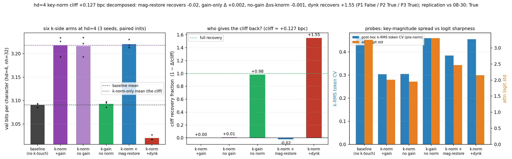

# What does the key norm destroy at hd=4 — per-token magnitude or direction? Decomposing the k-side cliff on paired inits

**Date:** 2026-08-31 · **Status:** done

## Hypothesis
2026-08-30 swapped the cliff's side: at hd=4 the KEY norm pays essentially the full QK-norm
cliff (+0.127) while the query norm is nearly free (+0.024) — contradicting the 08-02/06
q-side magnitude story, which was only ever tested on top of full qknorm. Tonight factors
the key norm into three components on byte-identical paired inits: the learnable gain, the
per-token magnitude VALUE, and the magnitude GRADIENT channel. Predictions registered up
front: P1 if the cliff is magnitude-value destruction, a detached-magnitude-restore arm
recovers most of it and gain-without-norm stays at baseline; P2 the gain is not the cliff;
P3 if 08-02's "key-side restoration hurts" was a full-qknorm artifact, undetached dynk
should HELP on top of k-norm-only.

## Method
- Architecture: 2-layer pre-norm char-GPT, d_model=128, hd=4 (nh=32), ~424k params — the
  07-30/…/08-30 harness byte-for-byte (600 steps, AdamW 3e-3 cosine, val bpc on 480 blocks).
- Task / dataset: character-level LM on tiny-shakespeare.
- Six k-side arms x 3 seeds = 18 runs, paired inits (all extras init to ones, no RNG),
  shared batch streams; q is never normed:
  `baseline` (anchor) · `knorm_only` RMS-norm+gain (anchor, the cliff arm) ·
  `knorm_nogain` (gain frozen at 1) · `kgain_only` (gain, no norm) ·
  `knorm_magrestore` (normalize the direction, multiply back the DETACHED per-token k-RMS —
  forward value equals `kgain_only`, but the gradient to k is radially projected) ·
  `knorm_dynk` (knorm_only + undetached per-head tau=clamp(r/EMA,1/c,c)^alpha, the 08-06
  machinery on the key side).
- In-run replication anchors: baseline and knorm_only reproduce the 2026-08-30 hd=4
  per-seed values to delta 0.00000 (6/6 pairs).

## Result
The magnitude-VALUE account is refuted and the cliff is a GRADIENT phenomenon
(`results.json → metrics.decomposition`):

| arm | val bpc (3 seeds) | Δ vs baseline | cliff recovery |
|---|---|---|---|
| baseline | 3.0904 | — | — |
| knorm_only | 3.2178 | +0.127 | 0 (the cliff) |
| knorm_nogain | 3.2163 | +0.126 | +0.01 |
| kgain_only | 3.0927 | +0.002 | +0.98 |
| knorm_magrestore | 3.2204 | +0.130 | **−0.02** |
| knorm_dynk | **3.0201** | **−0.070** | **+1.55** |

`knorm_magrestore` has the SAME forward values as `kgain_only` (the per-token magnitude is
multiplied back, detached) yet pays the full cliff — while `kgain_only` is free. The only
difference between the two is the gradient path: normalization projects the radial
component out of the key gradient, so the QKV weights never receive the signal to shape
per-token key magnitudes. The cliff is that severed magnitude-GRADIENT channel, not the
missing magnitude value in the forward pass. The gain is fully exonerated (nogain within
0.0015 of knorm_only). And reopening the gradient channel through the undetached tau
(alphas stay engaged at 0.95, realized tau spread 0.46) does not just refund the cliff —
it beats the no-norm baseline by 0.070 bpc in 3/3 paired seeds at 08-30-baseline-level
seed spread (0.010): the best hd=4 configuration in the thread's nine nights (prior best:
08-06's undetached q-rescue at baseline +0.003).

## Takeaway
At tiny head dims, what key-normalization destroys is not information in the activations —
it is a gradient route: the per-token magnitude VALUE is worthless (restoring it recovers
−2% of the cliff) while the per-token magnitude GRADIENT is worth more than the cliff
itself (+155%). This reconciles the thread: 08-02's "key-side restoration hurts" was a
full-qknorm artifact (with q free to compensate, the k-channel was redundant), and 08-06's
98% q-side rescue and tonight's 155% k-side rescue are the same mechanism — undetached
per-token magnitude channels are how narrow heads express token-selectivity. Practical
rule update for hd≤4: norm nothing, or norm keys WITH the undetached dynamic-magnitude
term (which beats everything tested at this width). Next: does knorm_dynk's −0.070 win
survive at hd 16–64 where plain k-norm-only already wins, and does q-side dynq on top of
qnorm_only show the same overshoot?

## Novelty check
- Verdict: novel
- Closest prior work: QK-norm ablations ([Henry et al. 2020](https://arxiv.org/abs/2010.04245),
  [Lp-QKNorm 2026](https://arxiv.org/html/2602.05006v1), norm-aware linear attention
  [NaLaFormer](https://arxiv.org/html/2506.21137v1)) ablate the presence/placement of norms;
  our own 08-02/06 (q-side channels on full qknorm) and 08-30 (side attribution).
- How this differs: no prior work splits the key norm's damage into magnitude-value vs
  magnitude-gradient via a detached-restore arm on paired inits, or tests the undetached
  channel k-side without q-compensation. arXiv/OpenAlex APIs 403 from this container;
  checked via web search instead (queries recorded in the registry row).
