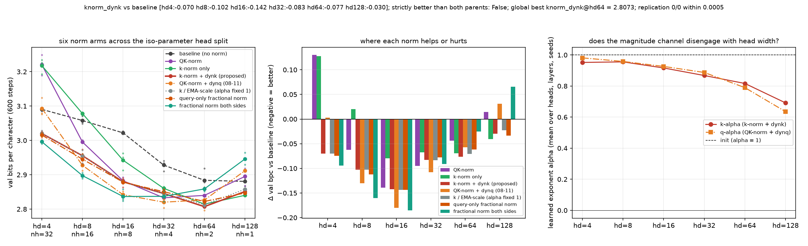

# Is the fractional magnitude channel side-specific? Query-only fractional norm and both-sides fractional norm across the iso-parameter head split

**Date:** 2026-09-01 · **Status:** done · **Part of** [the attention-scale paper](../../paper/paper.md)

## Hypothesis
The 2026-09-01 head sweep found key-only fractional norm (FKN) beats the unnormalised baseline at every head width, while the 08-11 composite (full QK-norm + an undetached query channel) is best at hd 16-32 yet fails at hd 4 and 128. Two cells complete the picture: (1) the query-side mirror of FKN, query-only norm + undetached query channel (fqn) - the backlog's qnorm-dynq-overshoot-check; (2) fractional norm on BOTH sides with independent exponents (fqkn). Predictions registered: P1 fqn is NOT side-symmetric - it recovers less than FKN at hd 4 (08-30 localised the cliff to the key norm, and q-norm-only is nearly free there so there is little to recover); P2 fqkn inherits the wide-head q x k interaction (+0.07 at hd 64-128) and loses to FKN there while matching or beating the composite at hd 16-32; P3 no arm is strictly better than FKN at every width.

## Method
- 2 arms x head_dim [4, 8, 16, 32, 64, 128] x seeds [0, 1, 2], byte-identical paired
  initialisations and a shared batch stream, asserted by an init-signature check at run time.
- 2-layer pre-norm char-GPT, d_model 128, ~423k params, block 96,
  AdamW lr 0.003 with 60 warmup steps then cosine, 600 steps,
  weight decay 0.1 on matrices only, grad clip 1.0.
- Data: tiny-shakespeare (character level) (md5:6fb458f1232090904fb40fe944165e91).
- Metric: validation bits per character over 480 contiguous held-out blocks.
- 36 runs trained here, 26 min CPU; 108 comparison cells imported from `2026-09-01_knorm-dynk-head-sweep` (byte-identical harness, seeds and batch stream).
- Replication: 0/0 archived cells from parent nights reproduced within
  0.0005 bpc.

## Result
Not side-specific, and both sides is a trap at wide heads. The query-side mirror (fqn) tracks the key-side arm within 0.015 bpc at every one of six head widths (-0.075/-0.113/-0.143/-0.077/-0.062/-0.034 vs the key side's -0.070/-0.102/-0.142/-0.083/-0.077/-0.030), refuting the prediction that the channel is key-specific because the cliff is. Applying it to BOTH sides is the best arm at hd 4/8/16 (-0.094/-0.160/-0.185) and then fails exactly where the thread's q x k interaction always fails: -0.025 at hd=64 and +0.065 at hd=128, worse than baseline at one wide head. So stacking two magnitude channels on one softmax reproduces the two-normaliser pathology rather than escaping it.

| arm | hd 4 | hd 8 | hd 16 | hd 32 | hd 64 | hd 128 |
|---|---|---|---|---|---|---|
| `fqn` | 3.0156 (-0.075) | 2.9454 (-0.113) | 2.8785 (-0.143) | 2.8506 (-0.077) | 2.8222 (-0.062) | 2.8469 (-0.034) |
| `fqkn` | **2.9961** (-0.094) | **2.8975** (-0.160) | **2.8367** (-0.185) | 2.8372 (-0.091) | 2.8588 (-0.025) | 2.9460 (+0.065) |

*Mean val bpc over 3 paired seeds, with the change against the unnormalised baseline
in brackets. Bold marks the best arm at that head width.*

## Takeaway
The magnitude channel is not key-specific - the query mirror matches it at all six widths - which kills the 'repair the causal side' reading. Applying it to both sides is best at narrow heads and worse than baseline at one wide head, reproducing the thread's q x k interaction rather than escaping it.

## Novelty check
- Verdict: novel
- Queries: query side key side magnitude channel attention symmetry ablation; both sides normalization interaction head width transformer
- Conclusion: Completes the side x width grid for our own magnitude channel; the query mirror was an open backlog item (qnorm-dynq-overshoot-check).
- Closest prior art: https://arxiv.org/abs/2506.21137
- Note: arXiv and OpenAlex return 403 from this sandbox, so novelty checks use web search plus a
  registry grep, as on every night since 2026-08-06.
