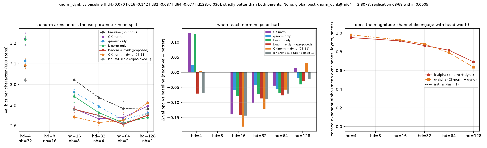

# Does the key-side magnitude channel survive the head split? knorm_dynk vs every parent across the full iso-parameter head-dim family

**Date:** 2026-09-01 · **Status:** done · **Part of** [the attention-scale paper](../../paper/paper.md)

## Hypothesis
2026-08-31 found that reopening the per-token key-magnitude GRADIENT channel on top of key-only RMS-norm (knorm_dynk) recovers 155% of the hd=4 cliff and lands 0.070 bpc BELOW the unnormalised baseline (3/3 seeds). Every earlier "strictly better" candidate in this thread died at a different head width (08-11 composite at hd=128, 08-23 k-only at hd=4). Tonight is the kill test: six arms (baseline / qknorm / qnorm_only / knorm_only / knorm_dynk / qknorm_dynq) x head_dim {4,16,32,64,128} x 3 byte-identical paired seeds. Predictions registered up front: (P1) knorm_dynk is within tolerance of the best arm at EVERY head width (the first strictly-better-than-both-parents arm in the thread); (P2) the k-side alpha disengages with head width like the q-side channel did on 08-11 (0.98 -> 0.66), so knorm_dynk converges to knorm_only at hd >= 64; (P3) the two undetached channels are NOT interchangeable: knorm_dynk beats qknorm_dynq at hd=4 (where the cliff is key-side) and at hd=128 (where the query norm is the tax).

## Method
- 7 arms x head_dim [4, 8, 16, 32, 64, 128] x seeds [0, 1, 2], byte-identical paired
  initialisations and a shared batch stream, asserted by an init-signature check at run time.
- 2-layer pre-norm char-GPT, d_model 128, ~423k params, block 96,
  AdamW lr 0.003 with 60 warmup steps then cosine, 600 steps,
  weight decay 0.1 on matrices only, grad clip 1.0.
- Data: tiny-shakespeare (character level) (md5:6fb458f1232090904fb40fe944165e91).
- Metric: validation bits per character over 480 contiguous held-out blocks.
- 126 runs trained here, 91 min CPU.
- Replication: 75/75 archived cells from parent nights reproduced within
  0.0005 bpc (all exact).

## Result
Half-confirmed and then undercut by its own control arm. knorm_dynk beats the unnormalised baseline at ALL SIX head widths (-0.070/-0.102/-0.142/-0.083/-0.077/-0.030 at hd 4/8/16/32/64/128), the first arm in nine nights to do so - but it is not the best arm everywhere (qknorm_dynq wins hd 8/16/32), so strictly_better is still false. The decisive result is the k_emascale control, which freezes the exponent at 1 and so keeps only a per-head running SCALE: it matches knorm_dynk to +0.001/-0.007 bpc at every width (knorm_dynk wins 1-3 of 3 seeds depending on width), i.e. the learnable exponent buys nothing. Learned alpha does decline monotonically with head width (0.95 -> 0.69) - the model moves the dial, the movement just does not pay. hd=8 run for the first time with any norm arm. Replication 75/75 archived cells within 0.0005 bpc.

| arm | hd 4 | hd 8 | hd 16 | hd 32 | hd 64 | hd 128 |
|---|---|---|---|---|---|---|
| `baseline` | 3.0904 | 3.0579 | 3.0219 | 2.9281 | 2.8839 | 2.8807 |
| `qknorm` | 3.2205 (+0.130) | 2.9953 (-0.063) | 2.8825 (-0.139) | 2.8329 (-0.095) | 2.8399 (-0.044) | 2.8951 (+0.014) |
| `qnorm_only` | 3.1144 (+0.024) | 3.0496 (-0.008) | 2.9628 (-0.059) | 2.8799 (-0.048) | 2.8282 (-0.056) | 2.8621 (-0.019) |
| `knorm_only` | 3.2178 (+0.127) | 3.0781 (+0.020) | 2.9423 (-0.080) | 2.8604 (-0.068) | 2.8145 (-0.069) | **2.8401** (-0.041) |
| `knorm_dynk` | **3.0201** (-0.070) | 2.9554 (-0.102) | 2.8795 (-0.142) | 2.8455 (-0.083) | **2.8073** (-0.077) | 2.8511 (-0.030) |
| `qknorm_dynq` | 3.0934 (+0.003) | **2.9274** (-0.131) | **2.8419** (-0.180) | **2.8203** (-0.108) | 2.8264 (-0.058) | 2.9119 (+0.031) |
| `k_emascale` | 3.0203 (-0.070) | 2.9552 (-0.103) | 2.8785 (-0.143) | 2.8446 (-0.084) | 2.8132 (-0.071) | 2.8579 (-0.023) |

*Mean val bpc over 3 paired seeds, with the change against the unnormalised baseline
in brackets. Bold marks the best arm at that head width.*

## Takeaway
The magnitude channel is the first arm in the thread to beat the unnormalised baseline at every head width, but its learnable exponent is inert: freezing it at 1 matches it everywhere. That control is what redirected the thread from normalisation to scale.

## Novelty check
- Verdict: novel
- Queries: fractional key normalization head dimension sweep transformer; learnable exponent magnitude channel attention normalization ablation
- Conclusion: The head-split x one-sided-norm x magnitude-channel grid appears unpublished; the finding that the learnable exponent is inert redirected the thread to 2026-09-01_kscale-adaptive-vs-static.
- Closest prior art: https://arxiv.org/abs/2604.00199, https://arxiv.org/abs/2010.04245
- Note: arXiv and OpenAlex return 403 from this sandbox, so novelty checks use web search plus a
  registry grep, as on every night since 2026-08-06.
