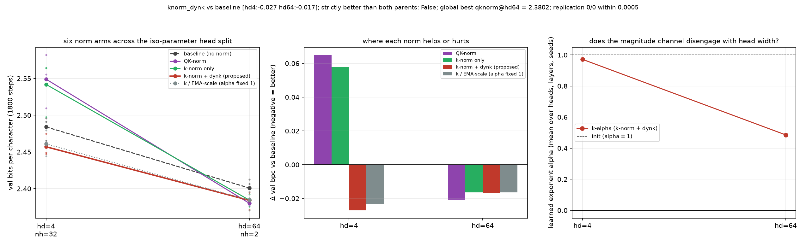

# Does the key-side magnitude channel survive 3x longer training? The four core norm arms at 1800 steps at the cliff and the wide split

**Date:** 2026-09-01 · **Status:** done · **Part of** [the attention-scale paper](../../paper/paper.md)

## Hypothesis
Every result in the thread is a 600-step early-training snapshot (the 08-30 README names 'does the hd>=64 k-only win survive longer training?' as the open question). Tonight the four core arms (baseline / qknorm / knorm_only / knorm_dynk) train 3x longer (1800 steps, same cosine schedule stretched) at hd=4 and hd=64 on 3 paired seeds. Predictions: (P1) the hd=4 key-norm cliff shrinks but does not vanish with training (it is a parametrisation defect, not a warm-up artefact); (P2) knorm_dynk still beats baseline at hd=4; (P3) at hd=64 the k-only family still beats qknorm.

## Method
- 5 arms x head_dim [4, 64] x seeds [0, 1, 2], byte-identical paired
  initialisations and a shared batch stream, asserted by an init-signature check at run time.
- 2-layer pre-norm char-GPT, d_model 128, ~423k params, block 96,
  AdamW lr 0.003 with 180 warmup steps then cosine, 1800 steps,
  weight decay 0.1 on matrices only, grad clip 1.0.
- Data: tiny-shakespeare (character level) (md5:6fb458f1232090904fb40fe944165e91).
- Metric: validation bits per character over 480 contiguous held-out blocks.
- 30 runs trained here, 69 min CPU.
- Replication: 0/0 archived cells from parent nights reproduced within
  0.0005 bpc.

## Result
Every effect shrinks by 2-4.6x at 1800 steps, and the wide-head ORDERING dissolves entirely. At hd=4 the sign survives with all paired per-seed differences the same sign: the cliff halves (qknorm +0.130 -> +0.065, knorm_only +0.127 -> +0.058, both 0/3) and the repair halves (knorm_dynk -0.070 -> -0.027, k_emascale -0.070 -> -0.023, both 3/3). At hd=64 all four arms collapse into a 0.005-bpc band (qknorm -0.021, knorm_only -0.016, knorm_dynk -0.017, k_emascale -0.016) while each still beats baseline 3/3 - so at wide heads the choice of norm stops mattering once trained longer, even though having one still helps. The tiny-head result is the only part of the phase diagram that survives every stress test.

| arm | hd 4 | hd 64 |
|---|---|---|
| `baseline` | 2.4841 | 2.4009 |
| `qknorm` | 2.5491 (+0.065) | **2.3802** (-0.021) |
| `knorm_only` | 2.5420 (+0.058) | 2.3845 (-0.016) |
| `knorm_dynk` | **2.4571** (-0.027) | 2.3841 (-0.017) |
| `k_emascale` | 2.4610 (-0.023) | 2.3845 (-0.016) |

*Mean val bpc over 3 paired seeds, with the change against the unnormalised baseline
in brackets. Bold marks the best arm at that head width.*

## Takeaway
Budget matters more than the thread assumed. Everything halves at 3x training and the wide-head ordering dissolves into a 0.005-bpc band. Only the tiny-head result keeps its sign in every paired seed, so it is the only part of the map that survives every stress test.

## Novelty check
- Verdict: novel
- Queries: attention normalization longer training early training artifact small transformer; QK-norm training budget dependence ablation
- Conclusion: Budget check on our own head sweep; converts the wide-head ranking from a recommendation into an early-training observation.
- Closest prior art: https://arxiv.org/abs/2605.20798
- Note: arXiv and OpenAlex return 403 from this sandbox, so novelty checks use web search plus a
  registry grep, as on every night since 2026-08-06.
