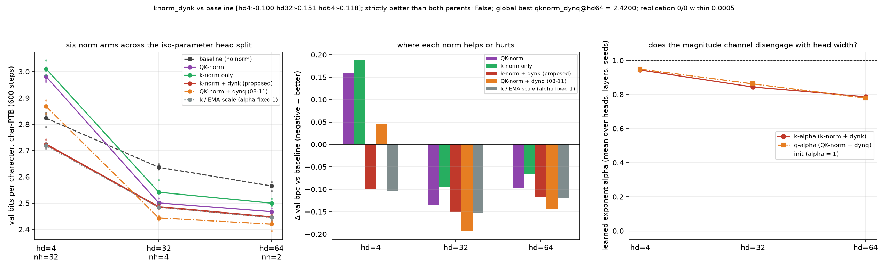

# Does the key-side magnitude channel transfer to a second corpus? The six norm arms on character-level Penn Treebank at the cliff, the optimum and the wide split

**Date:** 2026-09-01 · **Status:** done · **Part of** [the attention-scale paper](../../paper/paper.md)

## Hypothesis
Every number in the nine-night attention-norm thread comes from tiny-shakespeare. If the head-width phase diagram (tiny heads: norms hurt via the key side; mid: QK-norm best; wide: key-only best) and the knorm_dynk rescue are properties of the parametrisation rather than of one 1 MB corpus, they should reappear on character-level Penn Treebank (5 MB, 50-char vocab, very different statistics: lower-case, tokenised, <unk> symbols, N for numbers) with the identical recipe. Predictions: (P1) the hd=4 cliff replicates for qknorm and knorm_only and knorm_dynk closes it; (P2) at hd=64 knorm_only and knorm_dynk beat qknorm; (P3) the sign of every arm's delta vs baseline matches tiny-shakespeare at each of the three head widths.

## Method
- 6 arms x head_dim [4, 32, 64] x seeds [0, 1, 2], byte-identical paired
  initialisations and a shared batch stream, asserted by an init-signature check at run time.
- 2-layer pre-norm char-GPT, d_model 128, ~423k params, block 96,
  AdamW lr 0.003 with 60 warmup steps then cosine, 600 steps,
  weight decay 0.1 on matrices only, grad clip 1.0.
- Data: Penn Treebank, Mikolov preprocessing, character level (train/valid files) (md5:f26c4b92c5fdc7b3f8c7cdcb991d8420 (train), md5:aa0affc06ff7c36e977d7cd49e3839bf (valid)).
- Metric: validation bits per character over 480 contiguous held-out blocks.
- 54 runs trained here, 40 min CPU.
- Replication: 0/0 archived cells from parent nights reproduced within
  0.0005 bpc.

## Result
The tiny-head half transfers and gets LARGER; the wide-head half does not transfer at all. At hd=4 the normalisation cliff grows (qknorm +0.158, knorm_only +0.188 vs +0.130/+0.127 on shakespeare, 0/3 seeds beating baseline) and the magnitude repair still beats baseline 3/3 (knorm_dynk -0.100, k_emascale -0.105). But at hd=64 QK-norm does NOT lose on PTB (-0.098, 3/3) where it lost on shakespeare, and the composite qknorm_dynq wins at both hd=32 (-0.193) and hd=64 (-0.145). So 'drop the query norm at wide heads' is a tiny-shakespeare claim, not a general one, while 'norms hurt at tiny heads and the magnitude channel repairs them' survives a corpus change.

| arm | hd 4 | hd 32 | hd 64 |
|---|---|---|---|
| `baseline` | 2.8230 | 2.6360 | 2.5651 |
| `qknorm` | 2.9813 (+0.158) | 2.5005 (-0.135) | 2.4673 (-0.098) |
| `knorm_only` | 3.0106 (+0.188) | 2.5412 (-0.095) | 2.4996 (-0.065) |
| `knorm_dynk` | 2.7233 (-0.100) | 2.4852 (-0.151) | 2.4469 (-0.118) |
| `qknorm_dynq` | 2.8678 (+0.045) | **2.4433** (-0.193) | **2.4200** (-0.145) |
| `k_emascale` | **2.7179** (-0.105) | 2.4836 (-0.152) | 2.4450 (-0.120) |

*Mean val bpc over 3 paired seeds, with the change against the unnormalised baseline
in brackets. Bold marks the best arm at that head width.*

## Takeaway
The phase diagram splits in two. The tiny-head half (norms hurt, the magnitude channel repairs) transfers to a second corpus and gets larger. The wide-head half (drop the query norm) does not transfer at all and should not be quoted as a recommendation.

## Novelty check
- Verdict: novel
- Queries: QK-norm head dimension character level Penn Treebank ablation; attention normalization corpus transfer small transformer
- Conclusion: Second-corpus check of our own 2026-09-01 head sweep; splits the phase diagram into a transferring half and a corpus-specific half.
- Closest prior art: https://www.arxiv.org/abs/2602.05006
- Note: arXiv and OpenAlex return 403 from this sandbox, so novelty checks use web search plus a
  registry grep, as on every night since 2026-08-06.
