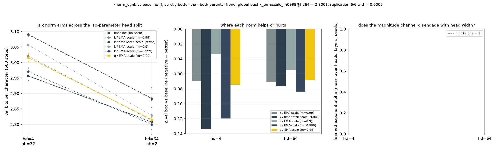

# Is the running-scale key win adaptive normalization or a better key scale? Static first-batch scale vs EMA at three momenta vs the query side, at the cliff and the wide split

**Date:** 2026-09-01 · **Status:** done · **Part of** [the attention-scale paper](../../paper/paper.md)

## Hypothesis
In the 2026-09-01 head sweep, dividing keys by a per-head EMA of their RMS with NO per-token normalization (k_emascale, alpha frozen at 1) reproduced FKN's 0.07 bpc win over the unnormalised baseline at hd=4, while 08-31 showed a learnable per-channel key gain is free (+0.002). Two accounts remain: (A) the win is an init-scale effect (keys start ~4x too small for sharp attention at hd=4, and any constant per-head rescale of that size would do), or (B) the win is ADAPTIVE (the running scale tracks the key statistics through training, an automatic temperature controller). Arms: k_static_init_scale freezes the per-head scale at its first-batch value (A's prediction: matches k_emascale); k_emascale at momentum 0.9 / 0.99 / 0.999 varies adaptation speed (B predicts a dependence, A predicts none); q_emascale applies the identical trick to queries (side-symmetry). Predictions registered: P1 static-init recovers less than half of k_emascale's win at hd=4; P2 the momentum sweep is monotone (faster tracking helps); P3 the query side gives at most half the key-side win.

## Method
- 6 arms x head_dim [4, 64] x seeds [0, 1, 2], byte-identical paired
  initialisations and a shared batch stream, asserted by an init-signature check at run time.
- 2-layer pre-norm char-GPT, d_model 128, ~423k params, block 96,
  AdamW lr 0.003 with 60 warmup steps then cosine, 600 steps,
  weight decay 0.1 on matrices only, grad clip 1.0.
- Data: tiny-shakespeare (character level) (md5:6fb458f1232090904fb40fe944165e91).
- Metric: validation bits per character over 480 contiguous held-out blocks.
- 36 runs trained here, 28 min CPU.
- Replication: 6/6 archived cells from parent nights reproduced within
  0.0005 bpc (all exact).

## Result
NOT adaptive - and the ordering is monotone in the opposite direction to the hypothesis. At hd=4 a per-head key scale FROZEN at its first batch gives -0.134 bpc, slow tracking (m=0.999) -0.120, standard (m=0.99) -0.070, fast tracking (m=0.9) -0.034; all 3/3 seeds vs baseline. The less the statistic adapts, the better it does, so the win is a constant, not a running normaliser. It is also not key-specific: the identical construction on the QUERY side gives -0.075 at hd=4 and -0.068 at hd=64, matching the key side. At hd=64 the picture is flatter (static -0.076, m0.999 -0.084, m0.99 -0.071, m0.9 -0.055) but still favours slow. Since a frozen per-head scale is algebraically a constant multiplier on the attention logits, this reframes the whole thread as a temperature question and motivates 2026-09-01_logit-scale-sweep.

| arm | hd 4 | hd 64 |
|---|---|---|
| `baseline` | 3.0904 | 2.8839 |
| `k_emascale` | 3.0203 (-0.070) | 2.8132 (-0.071) |
| `k_static_init_scale` | **2.9568** (-0.134) | 2.8078 (-0.076) |
| `k_emascale_m09` | 3.0566 (-0.034) | 2.8289 (-0.055) |
| `k_emascale_m0999` | 2.9706 (-0.120) | **2.8001** (-0.084) |
| `q_emascale` | 3.0159 (-0.075) | 2.8157 (-0.068) |

*Mean val bpc over 3 paired seeds, with the change against the unnormalised baseline
in brackets. Bold marks the best arm at that head width.*

## Takeaway
The win is a constant, not a running statistic: the less the per-head scale adapts, the better it does, and a scale frozen at the first batch is best. Since a frozen per-head scale is algebraically a fixed multiplier on the attention logits, this turns the whole thread into a temperature question.

## Novelty check
- Verdict: novel
- Queries: running average key norm attention adaptive vs static scale transformer; batch statistics key scale attention temperature ablation
- Conclusion: The adaptation-speed sweep (frozen / 0.999 / 0.99 / 0.9) as a test of whether a normaliser's benefit is adaptive appears unpublished; it is what turned this thread from normalisation to initialisation scale.
- Closest prior art: https://arxiv.org/abs/2510.22777, https://arxiv.org/abs/2604.00199
- Note: arXiv and OpenAlex return 403 from this sandbox, so novelty checks use web search plus a
  registry grep, as on every night since 2026-08-06.
