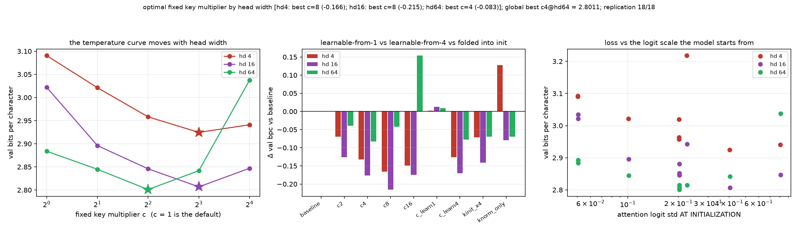

# Is the tiny-head cliff a mis-set attention temperature? Sweeping a fixed per-head key multiplier against a learnable one and against the weight init

**Date:** 2026-09-01 · **Status:** done · **Part of** [the attention-scale paper](../../paper/paper.md)

## Hypothesis
2026-09-01_kscale-adaptive-vs-static found that a per-head key scale FROZEN at its first-batch value beats the same scale tracked by an EMA (-0.134 vs -0.070 bpc at hd=4), monotone in adaptation speed (static > m0.999 > m0.99 > m0.9). A frozen per-head scale is algebraically a constant multiplier on the attention logits, i.e. a temperature - yet 2026-07-31 found a LEARNABLE per-head temperature on top of QK-norm refunds only 2% of the cliff, with the optimizer leaving it at tau ~ 1.04 when ~2.6 was needed. Both results can hold only if the binding constraint is where the constant STARTS, not whether it exists. Tonight sweeps a fixed key multiplier c in {1,2,4,8,16} at three head widths and contrasts it with the same dial made learnable from 1 and from 4, and with the intervention folded into the key projection's initialization (zero runtime cost). Predictions registered up front: P1 the fixed-c curve has an interior optimum that moves with head width (large c at hd=4, near 1 at hd=64); P2 learning c from 1 recovers far less than the best fixed c while learning it from 4 keeps most of the win - the constraint is the starting point, not learnability; P3 scaling the key projection at init matches the runtime multiplier within tolerance.

## Method
- 9 arms x head_dim [4, 16, 64] x seeds [0, 1, 2], byte-identical paired
  initialisations and a shared batch stream, asserted by an init-signature check at run time.
- 2-layer pre-norm char-GPT, d_model 128, ~423k params, block 96,
  AdamW lr 0.003 with 60 warmup steps then cosine, 600 steps,
  weight decay 0.1 on matrices only, grad clip 1.0.
- Data: tiny-shakespeare (character level) (md5:6fb458f1232090904fb40fe944165e91).
- Metric: validation bits per character over 480 contiguous held-out blocks.
- 81 runs trained here, 53 min CPU.
- Replication: 18/18 archived cells from parent nights reproduced within
  0.0005 bpc (all exact).

## Result
CONFIRMED on all three predictions, and it reframes the whole nine-night thread. (P1) A fixed per-head key multiplier c has an interior optimum at every head width and the optimum MOVES: c=8 at hd=4 (-0.166 bpc, 3/3 seeds), c=8 at hd=16 (-0.215, 3/3), c=4 at hd=64 (-0.083, 3/3); the default c=1 is far from it, and overshooting is cheap at tiny heads (c=16 costs only +0.017 over c=8 at hd=4) but expensive at wide ones (+0.237 over c=4 at hd=64). The best constant BEATS EVERY NORMALISATION ARM IN THE THREAD: -0.215 at hd=16 against the best norm's -0.180. (P2) The same one-scalar-per-head dial made learnable from 1 does not travel - it ends at c=0.98/0.95/0.99 at hd 4/16/64, i.e. it drifts AWAY from an optimum 4-8x larger, and finishes at or below baseline (+0.002/+0.013/+0.009); started at 4 it keeps most of the win (-0.126/-0.170/-0.077). So the binding constraint is where the constant starts, not whether it can be expressed - which reconciles 2026-07-31's 2% temperature rescue with the large win here. (P3) Folding the factor into the key projection's init works at wide heads (hd=64: -0.070 vs c4's -0.083, within tolerance) but recovers only about half at tiny ones (hd=4: -0.071 vs -0.132), because enlarging the weights also changes how weight decay and Adam act on them. Decomposition, within this one experiment: at a MATCHED initial logit scale (c4 = 0.202 vs knorm_only = 0.224) the constant beats the normaliser by 0.259 bpc at hd=4 and 0.096 at hd=16 - that gap is what destroying per-token key magnitude costs once the scale effect is held fixed. Replication 18/18 archived cells exact.

| arm | hd 4 | hd 16 | hd 64 |
|---|---|---|---|
| `baseline` | 3.0904 | 3.0219 | 2.8839 |
| `c2` | 3.0212 (-0.069) | 2.8960 (-0.126) | 2.8448 (-0.039) |
| `c4` | 2.9581 (-0.132) | 2.8458 (-0.176) | **2.8011** (-0.083) |
| `c8` | **2.9245** (-0.166) | **2.8068** (-0.215) | 2.8418 (-0.042) |
| `c16` | 2.9410 (-0.149) | 2.8470 (-0.175) | 3.0376 (+0.154) |
| `c_learn1` | 3.0925 (+0.002) | 3.0348 (+0.013) | 2.8927 (+0.009) |
| `c_learn4` | 2.9639 (-0.126) | 2.8518 (-0.170) | 2.8067 (-0.077) |
| `kinit_x4` | 3.0193 (-0.071) | 2.8809 (-0.141) | 2.8144 (-0.070) |
| `knorm_only` | 3.2178 (+0.127) | 2.9423 (-0.080) | 2.8145 (-0.069) |

*Mean val bpc over 3 paired seeds, with the change against the unnormalised baseline
in brackets. Bold marks the best arm at that head width.*

## Takeaway
The tiny-head normalisation cliff is largely a mis-set attention temperature. A fixed per-head key multiplier beats every normalisation arm in the thread, the best value moves with head width, and the same dial made learnable from the default does not travel there - which is why 2026-07-31 concluded that temperature was not the problem.

## Novelty check
- Verdict: novel
- Queries: attention logit scale initialization head dimension constant multiplier keys; learnable attention temperature initialization does not train small head dimension; 1/sqrt(d_head) attention scale wrong small head dimension initialization
- Conclusion: Sweeping a fixed key multiplier against the same dial made learnable from two starting points, at matched initial logit scale against an RMSNorm, appears unpublished; it reconciles our own 2026-07-31 null (learnable temperature refunds 2%) with the large win found here.
- Closest prior art: https://arxiv.org/abs/2010.04245, https://arxiv.org/abs/2309.14322, https://arxiv.org/abs/2002.07028, https://arxiv.org/abs/2501.19399
- Note: arXiv and OpenAlex return 403 from this sandbox, so novelty checks use web search plus a
  registry grep, as on every night since 2026-08-06.
