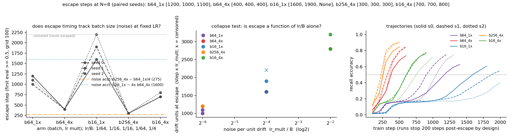

# MQAR escape sublinearity: gradient noise (batch size) IS the residual

**Date:** 2026-09-01 · **Status:** done (positive — the last-suspect-but-one is convicted)

## Hypothesis
The mqar thread has been decomposing why uniform x4 LR escapes the recall plateau at 400/400/400 instead of the exact-inverse ~275: 2026-08-13 attributed ~43% to gate-lag, and 2026-08-26 exonerated weight decay to the seed level, leaving stochastic-gradient diffusion and plateau curvature as the only suspects. Batch size is the clean noise dial: under Adam, drift per step ~ lr while diffusion per step ~ lr²/B, so noise accumulated per unit drift ~ lr/B — varying B at fixed LR changes noise with drift fixed. If the residual is noise, escape time in drift units (step × lr_mult) should be a function of lr/B alone: the matched pair (1x, B=16) ≈ (4x, B=64) should coincide, (4x, B=256) should restore the exact inverse of (1x, B=64) (~step 275-300), and the eerie 9/9 step-400 determinism at x4 should degrade as B shrinks. If escape steps are B-invariant at fixed LR — the wd result all over again — noise is exonerated and curvature is the last suspect.

## Method
- Architecture: the 2026-08-26 harness byte-for-byte — 2-block decay-masked elu+1 linear attention (dense per-channel gate, bias init 3.0), d_model 64, 2 heads, ~94k params; AdamW lr 1e-3 base, wd 0.01 everywhere.
- Task / dataset: MQAR N=8 (key/val vocab 64), fresh batches, generators byte-identical to 2026-07-26 through 2026-08-26; 512-sequence held-out eval, eval grid 100, escape = first eval ≥ 0.5, cap 2000.
- Arms (5 × 3 paired seeds = 15 runs, byte-identical inits per seed; same-B arms share the data stream exactly): b64_1x and b64_4x (in-run replication anchors of 08-26 j1/j4), b16_1x (lr/B = 1/16, noise-matched to b64_4x), b256_4x (lr/B = 1/64, noise-matched to b64_1x), b16_4x (lr/B = 1/4, most noise — the determinism-break probe).
- Cost controls, new this row: runs stop 2 evals (200 steps) after escape (acc reported as acc_at_stop, NOT comparable to prior rows' final accs), and b256_4x is capped at 1200 steps (~0.61 s/step on this 2-core box; not escaping by 3x its LR-mate's 400 would already decide the question).

## Result
**Noise is convicted — batch size moves escape timing at fixed LR in both directions, exactly where weight decay moved nothing, and the matched-noise pairs collapse to within ~10%.** Escape steps: b64_1x [1200, 1000, 1100] and b64_4x [400, 400, 400] (both anchors seed-exact replications of 08-26, travel readouts matching to 4 decimals), b16_1x [1600, 1900, censored >2000], **b256_4x [300, 300, 300]**, b16_4x [700, 700, 800]. In drift units at escape the arms line up by lr/B and monotonically: 1100 (b64_1x) ≈ 1200 (b256_4x) at lr/B=1/64; 1600 (b64_4x) ≈ 1750 (b16_1x, censored seed excluded) at 1/16; 2933 (b16_4x) at 1/4 — matched-pair ratios 0.917 and 1.094 while unmatched levels differ 1.45-2.7x (`matched_noise_pairs` in `results.json`). The headline prediction lands: at B=256 the x4 run escapes at 300/300/300, restoring the inverse to ratio 3.667 (vs 2.75 at B=64; exact 4.0 would need escape at 275, unresolvable on the 100-step grid). The determinism prediction also lands with a twist: step-determinism at x4 is not destroyed by MORE noise per sample at B=16 (700/700/800, one grid tick of spread) but it does degrade monotonically with lr/B on the 1x side (spread 200 at b64_1x, ≥400 with one censor at b16_1x) — determinism tracks total noise, and B=256 keeps it perfect (0 spread) at the new, earlier step. Caveat: b16_1x seed 2 is censored climbing (0.404 at step 2000, still rising), echoing the 2026-07-25 zoology warning that batch 16 is hostile to recall — here it reads as plateau stretched ~2x, not circuit death.

## Takeaway
The ~1.45x residual sublinearity of MQAR plateau escape under LR scaling is stochastic-gradient noise, and the sign matters: on this plateau noise HURTS — more diffusion per unit drift (smaller B or larger lr) means MORE drift to escape, the opposite of the noise-driven-escape folklore from saddle/flat-minima theory (Xie et al. 2002.03495 predicts large batch escapes exponentially SLOWER; here B=256 escapes earlier and B=16 later, in steps and in drift units). Escape time collapses onto noise-per-drift lr/B to within ~10% across a 4x change in both lr and B, so LR scaling experiments on this task are really moving two dials at once: drift speed (the intended one) and lr/B (the confound). Practical corollary for the thread: the "sublinear speedup" of x4 LR is mostly self-inflicted noise, and scaling B with lr (b256_4x) buys back most of it, plus perfect step-determinism at the earlier step. The surviving ~10% non-collapse (b256_4x at 1200 drift units vs b64_1x's 1100; grid granularity 33% at step 300) is the remaining room for curvature. Next: finer eval grid around escape + interpolated escape times to measure the collapse exponent properly (is it lr/B or lr²/B?), noted in the backlog.

## Novelty check
- Verdict: novel (as a measurement; the diffusion frame is prior art)
- Closest prior work: [A Diffusion Theory for Deep Learning Dynamics (Xie et al.)](https://arxiv.org/pdf/2002.03495v12) (escape-time theory — predicts the OPPOSITE sign for basin escape); [SGD saddle-escape lecture notes](http://mitliagkas.github.io/ift6085-2019/ift-6085-bonus-lecture-saddle-points-notes.pdf) and [batch size vs learning rate folklore](https://apxml.com/courses/deep-learning-regularization-optimization/chapter-7-optimization-refinements-tuning/batch-size-learning-rate) (the lr/B noise-scale frame); [Revisiting associative recall in modern recurrent models](https://arxiv.org/html/2508.19029) (MQAR training dynamics, no batch-size escape timing); own registry 2026-08-13/08-26 (the decomposition being finished) and 2026-07-25_zoology-mqar-recall (the batch-16 caveat).
- How this differs: no work we can find measures batch-size dependence of plateau-BREAKOUT timing on associative recall with noise-matched (lr, B) pairs on byte-identical paired inits; the observed noise-hurts sign against the diffusion-escape folklore, and the lr/B collapse of escape drift-time, appear unreported.
